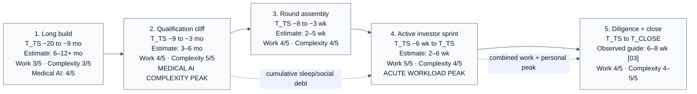
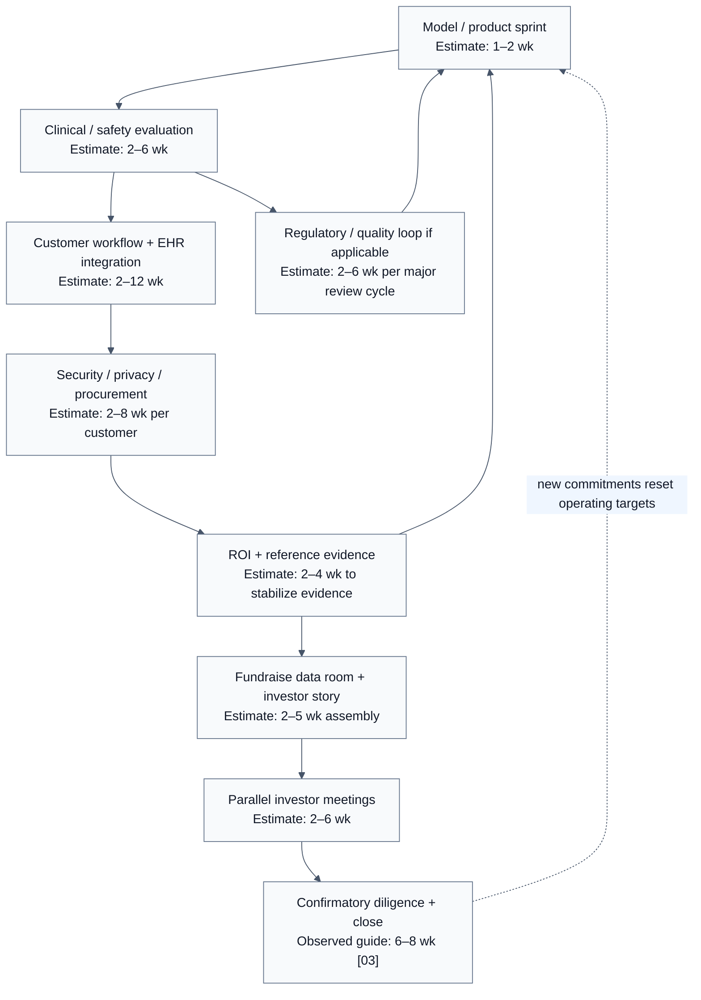
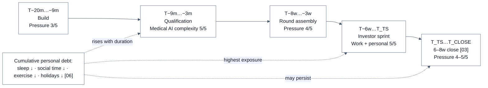
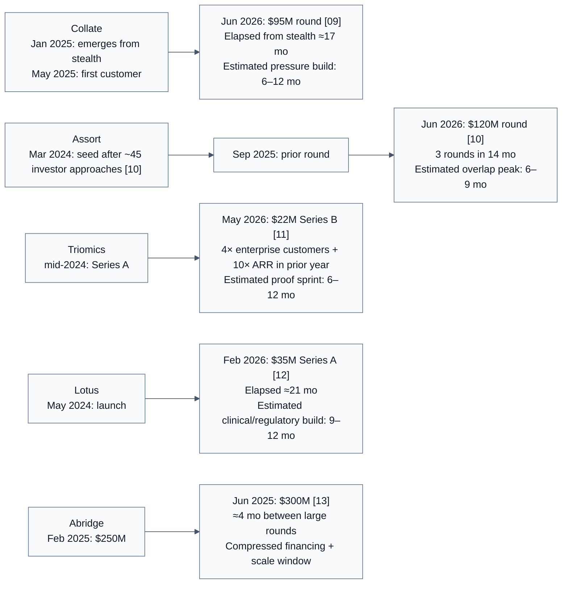

## Submissions
- ChatGPT 5.6 Thinking Extended

# The Founder Pressure Curve Before a Major Funding Round
## Medical AI first, then other startup fields

**Prepared:** 2026-08-16  
**Geographic emphasis:** San Francisco Bay Area / U.S. venture ecosystem  
**Primary question:** *When, exactly, are the hardest periods for startup founders before a major funding round, considering repeated workload/complexity, personal losses, and the interaction of both?*  

> **Interpretation note.** This is an evidence synthesis, not a clinical, legal, investment, or employment prescription. “Major funding round” means a financing that materially changes runway and company trajectory—most often an institutional Seed, Series A, Series B, or later priced round. The analysis distinguishes **term sheet** (`T_TS`) from **cash close** (`T_CLOSE`) because the period between them can remain highly demanding. Carta notes that legal negotiations and closing after a Series A term sheet can last about **6–8 weeks** [03].
>
> **Estimate note.** Durations labeled **Estimate** are planning ranges synthesized from founder/operator practice, YC sequencing guidance, current funding-market data, and the case studies in Part II. They are not universal empirical averages. Company-specific regulatory status, runway, revenue, team size, founder health, family responsibilities, and investor leverage can shift the curve materially.

---

# Executive answer

The hardest period is usually **not one single pitch day**. It is a sequence of overlapping pressure peaks.

For a typical venture-backed startup approaching a major round, the **acute workload peak** is the **2–6 weeks immediately before a term sheet**, when founders intentionally compress investor meetings, reference calls, follow-ups, data-room requests, board/customer work, and ordinary company leadership into the same calendar. YC’s Aaron Harris explicitly recommends a parallelized fundraising process and says fundraising consumes essentially all founder time and energy when done seriously [01].

The **complexity peak** usually begins **earlier**, around **3–9 months before the term sheet**, because the startup must become “fundable” before it can efficiently raise. In 2025 Carta reported a median **616 days from Seed to Series A**, more than 20 months, while investors had become more selective and were expecting stronger revenue/efficiency evidence [02]. The hardest pre-round work therefore often consists of months of repeated product, customer, hiring, finance, security, and operating loops before the formal raise even begins.

For **Medical AI**, the complexity peak is usually earlier and wider than for generic SaaS because the startup may need to repeat not only product-market-fit loops, but also clinical-safety evaluation, human-review design, privacy/security controls, health-system integrations, procurement, evidence generation, and—in some products—FDA device/CDS regulatory work. Current FDA guidance distinguishes non-device clinical decision support from regulated device software and maintains a substantial digital-health guidance stack for AI-enabled device functions [07]. HIPAA-regulated organizations and business associates must also protect electronic protected health information with administrative, physical, and technical safeguards [08].

The **combined workload + personal-impact peak** is most plausibly the **last 2–4 weeks before the term sheet through the 6–8 week closing period**, especially when it follows several months of operational overdrive. This timing is a synthesis rather than a directly measured epidemiological result. The evidence on founder well-being is strong enough to show the underlying risk: in Sifted’s 2025 survey of 138 founders, 67% reported working more than 50 hours per week, 72% made fewer social plans, 61% took fewer holidays, 47% exercised less, 36% deprioritized healthy eating, 54% reported burnout, and fundraising was the most commonly cited challenge [06]. YC separately warns that a three-month period of pushing off social obligations is difficult to sustain much longer while remaining happy and productive, and that high-growth startups can be all-consuming for family and personal life [01].

**Bottom line:**

- **Hardest for repeated complexity:** approximately **T_TS −9 months to −3 months**; for Medical AI, often the most structurally difficult phase.
- **Hardest for acute workload/context switching:** approximately **T_TS −6 weeks to T_TS**, with the sharpest concentration often in the first **1–3 weeks of a parallel investor process**.
- **Hardest for personal health/relationship erosion:** often cumulative, becoming most visible in approximately **T_TS −4 weeks through T_CLOSE**, a window that can span roughly **8–12 weeks** when closing follows a term sheet by 6–8 weeks [03].
- **Hardest overall (work + personal):** the overlap of a mature “qualification cliff” with the active raise—usually **the final 1–3 months before the term sheet**, continuing into diligence/close.
- **Literal loss of possessions:** credible startup literature and current news do **not** provide a defensible prevalence estimate. Financial strain, self-funding, reduced salary, loans, or savings exposure can occur, but “selling possessions” should not be treated as a typical founder milestone without company-specific evidence. Mercury’s 2025 survey shows diverse early-stage financing—including substantial loan usage in tech—but does not establish personal-asset loss [20].

---

# Scope and evidence hierarchy

This report gives priority in this order:

1. **Medical AI / healthcare AI** startups, particularly Bay Area-linked companies and investors.
2. **Other AI/software** startups.
3. **Fintech, deep tech/hardware, biotech, climate/industrial, consumer/marketplace**, where the timing pattern differs.

The evidence hierarchy is:

- **Part I:** founder/operator guidance and ecosystem data from Y Combinator, Carta, Bay Area-linked academic work, plus primary U.S. healthcare-regulatory sources [01]–[08], [20].
- **Part II:** high-impact startup news where the financing size, growth compression, regulatory burden, or founder impact is material enough to illuminate the pressure curve [09]–[19], [21], [22].
- Named-founder personal harm is **never inferred** from a company’s fundraising velocity. Where a news story does not report health, relationship, or financial loss, the table explicitly says **“not publicly reported.”**

---

# Part I — Expert synthesis from Bay Area startup practice

## I.1 The five-stage pre-round pressure model

The model below uses two anchors:

- `T_TS`: signed term sheet.
- `T_CLOSE`: completed financing / cash close.

### Stage 1 — Long build: “earn the right to raise”

**Typical position:** `T_TS −20 to −9 months`  
**Estimated duration:** **6–12+ months**  
**Primary burden:** product-market fit, revenue/growth, team formation, burn control, repeat customer learning.  
**Medical AI addition:** clinical workflow discovery, privacy/security architecture, evidence strategy, human-in-the-loop design, health-system integration design, and possible regulatory classification analysis.

YC’s fundraising philosophy is fundamentally sequencing-oriented: spend concentrated time building product and talking to customers, then switch into fundraising rather than trying to do both indefinitely [01]. For Series A, Harris described the company-building period as commonly taking 6, 12, 18, or 24 months before the raise and advised building relationships with a small number of Series A investors periodically while keeping the founder’s main attention on product-market fit [01].

Current market data has stretched this build phase. Carta measured a **616-day median Seed-to-Series-A interval in Q2 2025** [02], and WSJ/Crunchbase analysis reported an average of about **2.5 years to reach Series A** for U.S. startups with at least $1 million of initial pre-seed/seed funding, versus about 1.5 years in 2015 [17]. These are not measures of founder suffering, but they mean the “prove it before the A” period can now be materially longer.

### Stage 2 — Qualification cliff: “make the company undeniable”

**Typical position:** `T_TS −9 to −3 months`  
**Estimated duration:** **3–6 months**  
**Primary burden:** repeated growth/retention loops, enterprise references, unit economics, leadership hiring, security/compliance, forecasting, board alignment, and story coherence.  
**Medical AI burden:** usually **highest relative complexity** here.

This is frequently the hardest stage for **complexity repetitions**, because investors are not merely buying a pitch; they are underwriting accumulated evidence. Carta reported that Series A deal count in Q2 2025 was down 18% year-over-year and that investors were becoming more selective, while a cited fintech investor said the Series A revenue bar he observed had moved from below $1M ARR several years earlier toward $5M–$10M for some companies [02]. That quotation is sector/operator-specific—not a universal Series A requirement—but it captures the direction of travel: more proof before capital.

For Medical AI, the evidence stack can include multiple independent approval or trust gates:

- clinical usefulness and error analysis;
- model/version validation and monitoring;
- patient-safety or clinician-oversight design;
- HIPAA/security controls and customer security review [08];
- EHR/workflow integration and data mapping;
- ROI evidence for health systems/payers/life-sciences customers;
- FDA pathway analysis where functionality may constitute a device, plus applicable software/device guidance [07];
- quality, auditability, and governance artifacts increasingly demanded by buyers and investors [15].

### Stage 3 — Round assembly: “turn operations into an investable package”

**Typical position:** `T_TS −8 to −3 weeks`  
**Estimated duration:** **2–5 weeks**  
**Primary burden:** deck, model, data room, cap table cleanup, KPI definition, cohort analyses, customer references, board prep, investor list, introductions, legal cleanup, and narrative rehearsal.

This stage creates high **context-switching density**. The same facts must be expressed repeatedly in different forms: board materials, investor deck, diligence spreadsheets, security responses, customer references, financial models, and recruiting/retention conversations. The work is often not intellectually novel on the tenth repetition, but it remains consequential because inconsistency damages credibility.

For Medical AI, round assembly often requires an additional “trust package”: validation summaries, clinical-advisor support, privacy/security posture, model-risk controls, regulatory rationale, and evidence that the product can survive enterprise scrutiny. Healthcare VCs told Business Insider that 2026 investors would increasingly focus on cost savings, trust, data quality, transparency, and “glass-box” governance rather than merely an impressive model demo [15].

### Stage 4 — Active investor sprint: “parallelize or lose momentum”

**Typical position:** `T_TS −6 weeks to T_TS`  
**Estimated duration:** **2–6 weeks** when the company has leverage and a tight process; **longer** when outreach is cold, metrics are borderline, or the market is weak.  
**Primary burden:** investor meetings, partner meetings, reference calls, follow-ups, data requests, negotiation, and maintaining operating performance.

This is usually the **acute workload peak**. YC recommends parallelizing investor meetings—stacking them into a tight period—because a slow serial process lets information travel faster than the founder and destroys competitive tension [01]. Harris also warns that excessive meeting density becomes physically exhausting [01].

The central problem is that the startup does not stop operating merely because the CEO is fundraising. Product incidents, customer escalation, hiring, payroll/runway, and team morale continue. Thus the founder is temporarily running two organizations: the company and the financing process.

### Stage 5 — Term sheet to close: “the round is not done yet”

**Typical position:** `T_TS to T_CLOSE`  
**Estimated duration:** **6–8 weeks** for a Series A legal/diligence close, per Carta’s guide [03].  
**Primary burden:** legal documents, confirmatory diligence, cap-table/securities cleanup, investor syndicate completion, disclosure schedules, IP/employment checks, finance/tax requests, and continued business execution.

This can be a **second workload peak** because emotional relief after a term sheet can be premature. For a Medical AI company, diligence can also probe privacy/security, regulatory posture, clinical claims, insurance, contracting, data rights, and customer concentration more deeply than a standard software company.

---

## I.2 Professional machine-readable diagram — pressure curve



**Interpretation:** for generic SaaS, Stage 4 is often the sharpest peak. For Medical AI, Stage 2 can equal or exceed Stage 4 in total difficulty because it contains more simultaneous proof systems. The most dangerous combined period is the **Stage 2 → Stage 4 carryover**, when a founder enters fundraising already depleted.

---

## I.3 Repeated workload and complexity loops

The following are **operator planning estimates**, not universal benchmarks. They answer the question “how many times do founders have to do the hard thing again?” rather than merely “how long does fundraising take?”

| Repetition loop | Medical AI planning estimate | Generic startup planning estimate | Why it becomes difficult before a round |
|---|---:|---:|---|
| Product/model iteration | 1–2 week loop × 6–20 loops over a half-year | 1–2 week loop × 6–20 | Every improvement must preserve reliability while growth expectations rise. |
| Customer discovery / ROI proof | 1–3 week loop × 6–20 accounts | 1–3 week loop × 6–20 | Investors want repeatability, not one enthusiastic design partner. |
| Health-system / enterprise integration | 2–12 weeks per deployment; often several parallel | 1–8 weeks per enterprise deployment | Integration failures hit revenue, referenceability, and trust simultaneously. |
| Security / procurement review | 2–8 weeks per major customer; repeated per counterparty | 1–6 weeks | Questionnaires and contract/security evidence are repetitive but customer-specific. |
| Clinical-safety / evaluation cycle | 2–6 weeks × 2–8 meaningful review cycles | Usually not applicable | False positives/negatives, hallucination risk, human override, and subgroup performance require structured review. |
| Regulatory/quality documentation | 2–6 weeks per major internal/reviewer loop; pathway-dependent | Usually not applicable | AI-enabled device/CDS status can add lifecycle documentation and change-control work [07]. |
| Data-room refresh | Weekly × 4–10 updates during active process | Weekly × 4–10 | Metrics, pipeline, hiring, cash, and cap-table facts must stay internally consistent. |
| Investor meeting cycle | 30–60 min meeting + prep/follow-up; repeated across a tightly stacked 2–6 week process | Same | YC recommends tight parallelization; repetition itself becomes exhausting [01]. |
| Diligence response cycle | 1–5 business days per request cluster over 6–8 weeks | Same | New questions often depend on prior answers, producing branching work [03]. |

### Medical AI repetition loop diagram



The key point is that Medical AI founders frequently face **nested loops**. A model change can trigger a new clinical evaluation; that can change an integration; that can trigger a customer review; that can update the ROI story; that can change an investor diligence answer. The repetition is therefore multiplicative rather than simply additive.

---

## I.4 Personal losses: what the evidence supports—and what it does not

### Health and sleep — strongest evidence of harm

Sifted’s 2025 founder survey provides direct, recent signals: 54% reported burnout in the prior year, 54% reported bouts of insomnia, 83% reported high stress, and 75% reported anxiety [06]. Because the survey is early-stage-heavy and 39% of respondents had raised in the prior six months, it is relevant to fundraising pressure, but it does **not** establish that fundraising caused every reported health outcome.

A separate peer-reviewed study of 242 entrepreneurs and 93 comparison participants found high lifetime prevalence of self-reported psychiatric conditions among the entrepreneur sample—49% reported at least one lifetime mental-health condition, with elevated rates of depression, ADHD, substance use, and bipolar disorder relative to the comparison group [05]. The paper is important context for founder vulnerability, but it is **not a stage-timing study** and should not be used to claim that a particular fundraising week causes a diagnosis.

### Relationships and social life — strong founder-practice evidence

YC’s Harris says the accelerator effectively gives founders permission to defer many social obligations for three months, but argues that doing so much longer is difficult while remaining happy and productive [01]. He also notes that a high-growth startup can be all-consuming and especially difficult with a young family [01]. Sifted’s survey provides complementary quantitative evidence: 72% reported fewer social plans and 61% fewer holidays [06].

**Likely timing:** relationship erosion is less a single-event loss than a **cumulative stock**. It often becomes most acute when the fundraising sprint begins after months of deadline-driven company building, because evenings/weekends that had already been consumed by operating work become investor time too.

### Exercise, food, and routine — moderate-to-strong evidence

In the Sifted survey, 47% said exercise routines had slipped and 36% said healthy eating had become less of a priority [06]. The practical significance is that these are the very recovery behaviors that protect cognitive performance during a high-context-switching period.

### Money, savings, and possessions — evidence is much weaker

There are credible examples of founders enduring long financing scarcity. Surbhi Sarna, later a YC partner and Collate founder, spent **18 months scraping together $500,000** for her first medical-device company, nVision Medical [22]. That is a direct example of financing hardship in a medical startup, but the source does **not** say she sold possessions or quantify personal savings lost.

Mercury’s 2025 survey of 1,500 U.S. early-stage founders/executives shows financing is diversified and that tech companies in its sample were especially likely to use loans; more than half of early-stage tech companies in the survey had not yet raised VC [20]. Again, business financing does not equal personal-asset loss.

**Conclusion for possessions:** selling a car, house, or other possessions is plausible in individual bootstrap stories but is too anecdotal to place on a professional “typical founder” timeline. This report therefore marks literal possessions loss as **company-specific / insufficient prevalence evidence**.

### Fundraising-related harassment and discrimination — severe subgroup risk

A 2025 Business Insider report on a Female Founders Alliance survey found that 8 of 180 early-stage female founders voluntarily described harassment, being hit on, or being demeaned by investors in an open-ended fundraising question; three described sexual propositions [19]. The survey was not designed as a prevalence study of harassment, and Business Insider could not independently verify all anonymous respondents, so the result should not be generalized to every female founder. It nevertheless identifies a **high-impact, fundraising-specific personal safety and psychological burden** that ordinary workload models miss.

---

## I.5 Combined workload + personal-effect model

The table below is a synthesis of the evidence, not a measured causal model.

| Relative period | Workload intensity | Complexity | Personal-impact risk | Combined founder-pressure interpretation |
|---|---:|---:|---:|---|
| `T_TS −20 to −9 mo` | 3/5 | 3/5 generic; 4/5 Medical AI | 2–3/5 | Sustainable only if founders maintain routines; long duration is the threat. |
| `T_TS −9 to −3 mo` | 4/5 | **5/5 Medical AI** | 3–4/5 | **Structural hardest phase for Medical AI.** Repeated proof loops accumulate fatigue. |
| `T_TS −8 to −3 wk` | 4/5 | 4/5 | 4/5 | Round prep adds a second job before meetings fully start. |
| `T_TS −6 wk to T_TS` | **5/5** | 4/5 | **5/5** | **Acute hardest phase.** Investor parallelization, operating incidents, and sleep/social compression overlap. |
| `T_TS to T_CLOSE` | 4/5 | 4–5/5 | 4–5/5 | **Second peak.** Relief is delayed until diligence/legal actually close; Carta estimates 6–8 weeks [03]. |

### Machine-readable combined-pressure diagram



---

## I.6 Why Medical AI deserves first priority

“Medical AI” is not one regulatory category, so the pressure curve depends on the product.

### Archetype A — administrative/workflow AI

Examples include scheduling, documentation, registry reporting, and life-sciences paperwork. These products may avoid some device-regulation burdens, but enterprise healthcare still imposes high privacy, security, integration, reliability, and procurement requirements. Assort Health’s scheduling product, for example, must encode office- and specialty-specific rules and has expanded into callbacks, rescheduling, document handling, and billing [10]. Collate’s life-sciences documentation product works in environments where regulatory submissions can reach thousands of pages and where human verification remains important [09].

**Hardest estimated pre-round window:** **T_TS −6 months to T_TS**, because enterprise rollout, proof of ROI, and fundraising can scale simultaneously.

### Archetype B — clinician-facing decision support / ambient intelligence

Abridge’s evolution from documentation toward clinical decision-support features illustrates the widening product surface [13], [14]. These companies must defend accuracy, workflow fit, EHR integration, data governance, customer trust, and sometimes reimbursement/coding value while scaling to large health systems.

**Hardest estimated pre-round window:** **T_TS −9 months to −1 month**, with a sharp fundraising peak layered on top.

### Archetype C — AI that participates directly in care or regulated device functions

Lotus Health’s model illustrates the burden: all-state practice infrastructure, malpractice insurance, HIPAA systems, human physician review, and the regulatory difficulty of AI-mediated diagnosis/prescriptions [12]. Separately, FDA’s current digital-health framework makes clear that some CDS functions are non-device functions while others remain device software; AI-enabled medical devices can face lifecycle, cybersecurity, submission, and change-control expectations [07].

**Hardest estimated pre-round window:** **T_TS −12 months to T_CLOSE**, because clinical, regulatory, operational, and fundraising work can all be gating items.

---

## I.7 Other fields — how the hardest window shifts

These are comparative planning ranges, with Medical AI remaining the priority benchmark.

| Field | Most difficult pre-round period | Dominant repeated complexity | Personal-risk pattern |
|---|---|---|---|
| **Medical AI** | **T−9 mo to close; acute peak T−6 wk to close** | Clinical/safety + security/privacy + integration + procurement + evidence + possibly FDA | Long cumulative load plus acute fundraise; highest multi-system complexity. |
| Generic AI / SaaS | T−3 mo to term sheet; acute T−6 wk | Growth, retention, enterprise rollout, inference cost, model/platform differentiation | Can become extreme when “996”-style norms are adopted; not evidence that 72-hour weeks improve outcomes [18]. |
| Fintech | T−4 mo to close | Compliance, fraud/risk, security, bank/partner dependencies, unit economics | Similar to enterprise SaaS but with regulatory/partner incident risk. |
| Deep tech / hardware | T−9 mo to −2 mo | Prototype → demo → reliability → supply chain → manufacturing plan | Long engineering cycles; deadline spikes around demonstrations and investor technical diligence. |
| Biotech therapeutics | Often T−18 mo to close | Scientific milestones, studies, regulatory interactions, manufacturing/CMC | Longer calendar exposure; a failed readout can instantly reset financing prospects. |
| Climate / industrial | T−12 mo to close | Pilots, project economics, hardware, permitting, offtake/customer proof | Long customer and capital cycles can prolong uncertainty. |
| Consumer / marketplace | T−6 mo to term sheet | Retention, cohort quality, growth loops, supply/demand liquidity | Acute growth pressure; usually fewer regulated trust gates than healthcare/fintech. |

Carta separately reports that later-stage capital cycles have also stretched: founders raising Series A were advised to plan for roughly **1,000 days / 2.7 years** of runway to a potential Series B, with a 2.75-year median A-to-B interval among companies that had raised a B in 2025 [04]. That does not describe pre-Series-A workload directly, but it explains why investors may scrutinize durability and capital efficiency more heavily at each major round.

---

# Part II — High-impact startup news cases

## II.1 Medical AI / healthcare AI cases

### 1. Collate — San Francisco life-sciences AI

**Funding event:** $95M round announced 2026-06-03 at a valuation approaching $1B; $125M total funding [09].  
**Compression signal:** the round came **17 months after emerging from stealth**. Collate signed its first customer in May 2025 and had signed roughly 50 more by June 2026, including major pharmaceutical, med-device, and biotech companies [09].  
**Complexity signal:** life-sciences submissions can run to roughly 10,000 pages; Collate reported large document-time reductions while still requiring human verification because hallucination/error risk matters [09].  

**Inferred hardest window (not reported by the founder as a stress measurement):** roughly **May 2025–May 2026**, with the **final 2–4 months** likely combining enterprise expansion, product validation, hiring, investor diligence, and a rapidly changing competitive market.

This case is unusually useful because Sarna’s first medical startup had a very different funding experience: Forbes reports that she spent **18 months** piecing together $500,000 for nVision Medical more than a decade earlier [22]. The contrast demonstrates that founder reputation, prior exit, network, and market timing can radically change the fundraising workload even when the underlying sector remains difficult.

**Personal losses publicly reported for the Collate raise:** **none specific.** Do not infer burnout, relationship damage, or financial loss from the financing pace.

### 2. Assort Health — San Francisco healthcare voice agents

**Funding event:** $120M round announced 2026-06-24 at a $1.2B valuation, the company’s **third venture round in 14 months** [10].  
**Scale signal:** about 15,000 physicians had rolled out the product; the company reported 190M patient interactions; Forbes estimated annualized revenue above $30M and reported company-stated 20× revenue growth over 15 months [10].  
**Complexity signal:** scheduling rules vary by specialty, office, provider, and appointment type; Assort expanded into callbacks, rescheduling, documents, and billing [10].  
**Earlier fundraising difficulty:** the founders approached about **45 investors** before securing a $3.5M seed round in March 2024 [10].

**Inferred hardest window:** **September 2025–June 2026**, because a prior funding event, 20× growth window, product-scope expansion, major customer onboarding, and another large raise overlapped.

**Personal losses publicly reported:** **none specific.** The article describes demanding business velocity, not founder health or relationship harm.

### 3. Triomics — oncology-specific AI

**Funding event:** $22M Series B announced 2026-05-27 [11].  
**Complexity signal:** oncology records can run to thousands of pages; the product spans trial matching, verifiable patient summaries, visit preparation, and legally mandated tumor-registry reporting [11].  
**Scale signal:** the company reported a **4× increase in enterprise customers** and **10× increase in annualized recurring revenue** over the preceding year [11].

**Inferred hardest window:** approximately **mid-2025 through spring 2026**, with the final quarter before the Series B likely carrying the heaviest overlap of deployment, referenceability, metrics packaging, and fundraising.

**Personal losses publicly reported:** **none specific.** The workload inference applies to the company operating system, not to any founder’s diagnosis or family life.

### 4. Lotus Health AI — AI-mediated primary care

**Funding event:** $35M Series A announced 2026-02-03, bringing total funding to $41M; company launched in May 2024 [12].  
**Complexity signal:** the service describes 24/7 care in 50 languages, licenses/operations across all 50 states, malpractice insurance, HIPAA-compliant systems, patient-record access, and board-certified physician review of final diagnoses, lab orders, and prescriptions [12].

**Inferred hardest window:** approximately **spring 2025 through January 2026**, with a strong **regulatory/clinical operations complexity peak** before the formal investor sprint.

**Personal losses publicly reported:** **none specific.** The regulatory/operational burden is observable; individual harm is not.

### 5. Abridge — ambient clinical AI at hyperscale

**Funding event:** $300M at a $5.3B valuation announced 2025-06-24, only about four months after a $250M round at a $2.75B valuation [13].  
**Complexity signal:** Abridge’s product sits inside clinical conversations and documentation; by 2026 it was working with Nvidia on a healthcare-specific model intended to support clinical documentation and decision-support tasks [14].  
**Competitive signal:** healthcare investors cited intensifying competition and pressure to prove cost savings, trust, data quality, and governance as Epic and other large technology players expand AI offerings [15].

**Inferred hardest window for the 2025 mega-round sequence:** **February–June 2025**. Raising two large rounds four months apart means the company was likely doing investor diligence, enterprise scaling, hiring, and product expansion with minimal decompression time between financing cycles.

**Personal losses publicly reported:** **none specific.** This is a workload/complexity case, not a founder-wellness case.

---

## II.2 Medical AI case comparison

| Company | Financing / date | High-impact pre-round signal | Estimated hardest pre-round interval | Primary pressure class | Founder personal loss evidence? |
|---|---|---|---|---|---|
| **Collate** | $95M, 2026-06-03 [09] | ~50 customers after first customer in May 2025; high-stakes regulatory documentation | ~6–12 months before round; sharp final 2–4 months | Enterprise + accuracy + life-sciences documentation + fundraising | Not publicly reported |
| **Assort Health** | $120M, 2026-06-24 [10] | 3 rounds/14 months; 20× revenue/15 months; 190M interactions | ~9 months; sharp final 2–3 months | Hypergrowth + integrations + repeat capital process | Not publicly reported |
| **Triomics** | $22M Series B, 2026-05-27 [11] | 4× enterprise customers; 10× ARR in a year; oncology data complexity | ~6–12 months | Clinical workflow + data + enterprise proof | Not publicly reported |
| **Lotus Health** | $35M Series A, 2026-02-03 [12] | 50-state care infrastructure + human physician review | ~9–12 months | Regulatory/clinical operations + product | Not publicly reported |
| **Abridge** | $300M, 2025-06-24 [13] | $250M round only ~4 months earlier; expanding product/enterprise surface | ~4 months between mega-rounds | Capital-process compression + enterprise clinical AI | Not publicly reported |

### Machine-readable Medical AI case timeline



---

## II.3 Other fields — only high-impact context

### AI/software work-hour escalation

The Washington Post reported in October 2025 that some Silicon Valley and New York AI startups were explicitly embracing “996” schedules—9 a.m. to 9 p.m., six days a week, or **72 hours**—and some job postings cited 70-hour weeks or six/seven-day in-person expectations [18]. The article also includes investors/former founders arguing that extreme hours can lead to burnout or lower-quality work [18].

**What this adds to the model:** it confirms that current AI competition can normalize a high baseline *before fundraising begins*. If a founder enters Stage 4 already operating at 60–70+ hours, there is little reserve capacity for a parallel investor process. It does **not** prove that 996 improves startup outcomes.

### Legal AI capital compression: Harvey

TechCrunch reported that Harvey raised a $300M Series E at a $5B valuation in June 2025, only four months after a $300M Series D at a $3B valuation [21]. This mirrors Abridge’s rapid financing cadence outside healthcare.

**What this adds:** in fast-moving AI categories, a “major round” may not provide a long recovery period; the next competitive financing/expansion cycle can begin almost immediately. The hardest period can therefore look like a **rolling pressure plateau**, not an isolated fundraising spike.

### The Series A crunch

Axios reported Carta data showing a high share of seed bridge rounds and a steep decline in Series A deal count from Q1 2022 to Q1 2025 [16]. WSJ separately reported that the average U.S. path to Series A had lengthened to about 2.5 years for a Crunchbase-defined cohort [17].

**What this adds:** more founders spend longer in the qualification phase. The personal risk is therefore not only “how intense is pitch month?” but “how long must the founder remain in an investor-grade growth state before pitch month is even rational?”

### Fundraising harassment as a non-workload personal cost

The 2025 Business Insider investigation/survey report on female founders identifies sexual harassment and demeaning investor behavior as a fundraising-specific burden for some founders [19]. This is high impact even though it is not a “workload” item.

**What this adds:** personal harm can come directly from the capital process itself, not merely from overwork. Risk models that only count hours systematically miss this category.

---

# Part III — “When exactly?” decision table

Use this as the shortest operational answer.

| Question | Generic venture-backed startup | Medical AI preference case | Confidence |
|---|---|---|---|
| **When is repeated complexity hardest?** | **3–6 months before term sheet** | **3–9 months before term sheet**, sometimes 9–12 months for clinically/regulatorily complex products | Medium: timing is synthesis; direction strongly supported by current funding and regulatory evidence [02], [07], [15] |
| **When is acute workload hardest?** | **2–6 weeks before term sheet** | Same, but entered with more pre-existing operational load | High for direction: YC explicitly recommends a tight parallel fundraising process [01] |
| **When are personal effects most likely to become visible?** | **Final 1–2 months before term sheet through close** | **Final 2–3 months through close**, because clinical/enterprise obligations are harder to pause | Medium: founder health data is strong, stage-specific timing is inferred [01], [06] |
| **When is workload + personal impact jointly hardest?** | **Final 1–3 months before term sheet + 6–8 week close** | **Final 3–6 months before term sheet + 6–8 week close** | Medium |
| **When is literal possessions loss most likely?** | No defensible universal stage | No defensible universal stage | Low / insufficient evidence; do not generalize |
| **When should founder protective systems be installed?** | **Before T−3 months**, not during pitch week | **Before T−6 months**, ideally before enterprise/clinical scale-up | Practitioner inference based on cumulative risk [01], [06] |

---

# Part IV — Founder “red-zone” indicators before a round

A founder is entering the highest-risk combined zone when several of these become true at once:

1. **Runway has become a clock**, not merely a metric.
2. The company still needs one or more **investor-grade proof points**—revenue, retention, reference customers, clinical evidence, regulatory clarity, security posture, or leadership hires.
3. The CEO has started **regular investor relationship meetings** while still owning core sales/product/operations.
4. Data-room questions are being answered from **different source systems**, forcing repeated reconciliation.
5. Customer deployments or pilots are parallel and founder-dependent.
6. In Medical AI, a single product/model change can trigger **clinical, integration, security, or regulatory re-validation**.
7. Social plans, exercise, sleep, or holidays have already been reduced—patterns that were common in Sifted’s founder survey [06].
8. The formal investor process becomes parallelized and tightly scheduled, as YC recommends [01].
9. A signed term sheet creates psychological relief, but 6–8 weeks of legal/diligence work remain [03].

The most important operational insight is that the round should be treated as a **capacity-planning event** months in advance. YC’s advice to separate company-building from formal fundraising is partly a productivity principle and partly a risk-control mechanism [01].

---

# Part V — Structured machine-readable stage data

The following JSON mirrors the diagrams. Durations are estimates unless a source is listed in `evidence`.

```json
{
  "schema_version": "1.0",
  "anchor_events": {
    "T_TS": "signed term sheet",
    "T_CLOSE": "financing cash close"
  },
  "stages": [
    {
      "id": "long_build",
      "window": "T_TS-20m to T_TS-9m",
      "duration_estimate": "6-12+ months",
      "generic_workload_1_to_5": 3,
      "generic_complexity_1_to_5": 3,
      "medical_ai_complexity_1_to_5": 4,
      "personal_risk_1_to_5": 3,
      "evidence": ["01", "02", "17"]
    },
    {
      "id": "qualification_cliff",
      "window": "T_TS-9m to T_TS-3m",
      "duration_estimate": "3-6 months",
      "generic_workload_1_to_5": 4,
      "generic_complexity_1_to_5": 4,
      "medical_ai_complexity_1_to_5": 5,
      "personal_risk_1_to_5": 4,
      "evidence": ["02", "07", "08", "15"]
    },
    {
      "id": "round_assembly",
      "window": "T_TS-8w to T_TS-3w",
      "duration_estimate": "2-5 weeks",
      "generic_workload_1_to_5": 4,
      "generic_complexity_1_to_5": 4,
      "medical_ai_complexity_1_to_5": 5,
      "personal_risk_1_to_5": 4,
      "evidence": ["01", "15"]
    },
    {
      "id": "active_raise",
      "window": "T_TS-6w to T_TS",
      "duration_estimate": "2-6 weeks",
      "generic_workload_1_to_5": 5,
      "generic_complexity_1_to_5": 4,
      "medical_ai_complexity_1_to_5": 4,
      "personal_risk_1_to_5": 5,
      "evidence": ["01", "06"]
    },
    {
      "id": "diligence_close",
      "window": "T_TS to T_CLOSE",
      "duration_estimate": "6-8 weeks",
      "generic_workload_1_to_5": 4,
      "generic_complexity_1_to_5": 4,
      "medical_ai_complexity_1_to_5": 5,
      "personal_risk_1_to_5": 4,
      "evidence": ["03"]
    }
  ]
}
```

---

# Limitations

1. **Founder health evidence is not precise stage-timing evidence.** Sifted is a recent but relatively small self-selected survey; Freeman et al. is peer-reviewed but measures lifetime psychiatric history rather than the weeks around fundraising [05], [06].
2. **News cases are selected for material signal.** Large rounds and rapid growth create observable operating compression, but news coverage rarely measures founder sleep, marriage quality, or personal finances. Those effects are therefore not attributed to named founders without explicit reporting.
3. **Medical AI is heterogeneous.** An administrative scheduling tool, an ambient scribe, a clinical decision-support system, and an FDA-regulated AI-enabled medical device have different regulatory burdens [07].
4. **Fundraising duration varies with leverage.** YC’s recommended tight, parallel process describes the desired execution pattern, not a guarantee that a round closes in 2–6 weeks [01].
5. **Possessions are under-measured.** Credible ecosystem sources discuss financing scarcity, self-funding, loans, salary tradeoffs, and runway more often than sale of personal assets. A professional model should therefore mark possessions loss as an evidence gap rather than invent a frequency.
6. **Correlation is not causation.** Long work hours, burnout, psychiatric history, startup outcomes, and fundraising difficulty can influence each other in both directions.

---

# References

[01]
```bibtex
@misc{ycombinator2019harrisfundraising,
  author = {{Y Combinator} and Harris, Aaron and Cannon, Craig},
  title = {{Aaron Harris on Fundraising and Meeting with Investors}},
  year = {2019},
  month = aug,
  day = {21},
  howpublished = {Y Combinator},
  url = {https://www.ycombinator.com/blog/aaron-harris-on-fundraising-and-meeting-with-investors},
  note = {Used for sequencing company-building versus fundraising, parallel investor meetings, Series A relationship-building, and founder personal-sacrifice discussion; accessed 2026-08-16},
}
```

[02]
```bibtex
@misc{dowd2025seriesa,
  author = {Dowd, Kevin},
  title = {{'Quantity is down, and quality is up': The new state of Series A fundraising}},
  year = {2025},
  month = sep,
  day = {19},
  howpublished = {Carta Data Desk},
  url = {https://carta.com/data/series-a-fundraising-q2-2025/},
  note = {Series A deal activity, valuation, selectivity, revenue expectations, and 616-day median Seed-to-Series-A interval; accessed 2026-08-16},
}
```

[03]
```bibtex
@misc{carta2025seriesaguide,
  author = {{Carta Team}},
  title = {{What is Series A Funding? How to Raise a Series A Round}},
  year = {2025},
  month = jul,
  day = {11},
  howpublished = {Carta},
  url = {https://carta.com/learn/startups/fundraising/series-a/},
  note = {Used for the estimate that legal negotiations and deal closing can last six to eight weeks after signing a term sheet; accessed 2026-08-16},
}
```

[04]
```bibtex
@misc{walker2025thousanddays,
  author = {Walker, Peter},
  title = {{Series A Founders Should Plan to Make Capital Last 1000 Days}},
  year = {2025},
  month = may,
  day = {30},
  howpublished = {Carta Data Desk},
  url = {https://carta.com/data/linkedin-series-a-make-it-last-1000-days/},
  note = {Used for 2.7-year planning guidance and a 2.75-year median Series-A-to-Series-B interval among companies raising a B in 2025; accessed 2026-08-16},
}
```

[05]
```bibtex
@article{freeman2019entrepreneurmentalhealth,
  author = {Freeman, Michael A. and Staudenmaier, Paige J. and Zisser, Mackenzie R. and Andresen, Lisa Abdilova},
  title = {{The prevalence and co-occurrence of psychiatric conditions among entrepreneurs and their families}},
  journal = {Small Business Economics},
  volume = {53},
  pages = {323--342},
  year = {2019},
  doi = {10.1007/s11187-018-0059-8},
  url = {https://doi.org/10.1007/s11187-018-0059-8},
  note = {Peer-reviewed self-report study of 242 entrepreneurs and 93 comparison participants; used as background on founder mental-health vulnerability, not as stage-specific causal evidence},
}
```

[06]
```bibtex
@misc{partington2025founderburnout,
  author = {Partington, Miriam and Dharampal-Hornby, Maya},
  title = {{More than half of founders experienced burnout last year}},
  year = {2025},
  month = feb,
  day = {26},
  howpublished = {Sifted},
  url = {https://sifted.eu/articles/founders-mental-health-2025},
  note = {Survey of 138 founders; used for workload, burnout, insomnia, social-plan, holiday, exercise, diet, and fundraising-challenge measures; accessed 2026-08-16},
}
```

[07]
```bibtex
@misc{fda2026digitalhealthguidances,
  author = {{U.S. Food and Drug Administration}},
  title = {{Guidances with Digital Health Content}},
  year = {2026},
  howpublished = {FDA Digital Health Center of Excellence},
  url = {https://www.fda.gov/medical-devices/digital-health-center-excellence/guidances-digital-health-content},
  note = {Current list includes final 2026 Clinical Decision Support guidance, final 2025 AI-enabled-device change-control guidance, cybersecurity guidance, and draft lifecycle guidance; accessed 2026-08-16},
}
```

[08]
```bibtex
@misc{hhs2026hipaasecurity,
  author = {{U.S. Department of Health and Human Services}},
  title = {{The Security Rule}},
  year = {2026},
  howpublished = {HHS Office for Civil Rights},
  url = {https://www.hhs.gov/hipaa/for-professionals/security/index.html},
  note = {Used for the requirement that covered entities and business associates protect electronic protected health information using administrative, physical, and technical safeguards; accessed 2026-08-16},
}
```

[09]
```bibtex
@misc{feldman2026collate95m,
  author = {Feldman, Amy and Knapp, Alex},
  title = {{AI Startup Collate Raises $95 Million To Automate Life Sciences Paperwork}},
  year = {2026},
  month = jun,
  day = {3},
  howpublished = {Forbes InnovationRx},
  url = {https://www.forbes.com/sites/innovationrx/2026/06/03/ai-startup-collate-raises-95-million-to-automate-life-sciences-paperwork/},
  note = {Used for Collate funding, 17-month timeline, customer count, life-sciences documentation scale, time-savings claims, and human-verification controls; accessed 2026-08-16},
}
```

[10]
```bibtex
@misc{feldman2026assort,
  author = {Feldman, Amy},
  title = {{These 29-Year-Olds' AI Agent For Scheduling Doctor Visits Is Now Worth $1.2 Billion}},
  year = {2026},
  month = jun,
  day = {24},
  howpublished = {Forbes},
  url = {https://www.forbes.com/sites/amyfeldman/2026/06/24/these-29-year-olds-ai-chatbot-for-scheduling-doctor-visits-is-now-worth-12-billion/},
  note = {Used for Assort Health's $120M round, third round in 14 months, physician adoption, patient interactions, revenue-growth claim, scheduling complexity, and seed outreach history; accessed 2026-08-16},
}
```

[11]
```bibtex
@misc{temkin2026triomics,
  author = {Temkin, Marina},
  title = {{Triomics nabs $22M to bring oncology-specific AI to cancer centers}},
  year = {2026},
  month = may,
  day = {27},
  howpublished = {TechCrunch},
  url = {https://techcrunch.com/2026/05/27/triomics-nabs-22m-to-bring-oncology-specific-ai-to-cancer-centers/},
  note = {Used for Series B funding, oncology record complexity, platform scope, 4x enterprise-customer growth, and 10x annualized recurring revenue claim; accessed 2026-08-16},
}
```

[12]
```bibtex
@misc{temkin2026lotus,
  author = {Temkin, Marina},
  title = {{Lotus Health nabs $35M for AI doctor that sees patients for free}},
  year = {2026},
  month = feb,
  day = {3},
  howpublished = {TechCrunch},
  url = {https://techcrunch.com/2026/02/03/lotus-health-nabs-35m-for-ai-doctor-that-sees-patients-for-free/},
  note = {Used for Series A funding, May 2024 launch, 50-state care infrastructure, malpractice/HIPAA systems, human physician review, and healthcare regulatory complexity; accessed 2026-08-16},
}
```

[13]
```bibtex
@misc{lin2025abridgefunding,
  author = {Lin, Belle},
  title = {{Abridge, Whose AI App Takes Notes for Doctors, Valued at $5.3 Billion at Funding}},
  year = {2025},
  month = jun,
  day = {24},
  howpublished = {The Wall Street Journal},
  url = {https://www.wsj.com/articles/abridge-whose-ai-app-takes-notes-for-doctors-valued-at-5-3-billion-at-funding-801825f3},
  note = {Used for Abridge's $300M round and the prior $250M round in February 2025; accessed 2026-08-16},
}
```

[14]
```bibtex
@misc{lin2026nvidiaabridge,
  author = {Lin, Belle},
  title = {{Nvidia Is Developing an AI Healthcare Model With Startup Abridge}},
  year = {2026},
  month = jun,
  day = {11},
  howpublished = {The Wall Street Journal},
  url = {https://www.wsj.com/cio-journal/nvidia-is-developing-an-ai-healthcare-model-with-startup-abridge-6db38c1b},
  note = {Used for Abridge-Nvidia healthcare-specific model development and the expansion toward clinical decision-support/documentation tasks; accessed 2026-08-16},
}
```

[15]
```bibtex
@misc{torrence2025healthcarevc2026,
  author = {Torrence, Rebecca},
  title = {{Healthcare VCs predict more AI transparency investment, private equity M&A, and a quiet year for IPOs in 2026}},
  year = {2025},
  month = dec,
  day = {22},
  howpublished = {Business Insider},
  url = {https://www.businessinsider.com/healthcare-vc-predictions-2026-more-ai-acquisitions-few-ipos-2025-12},
  note = {Used for investor emphasis on cost savings, patient/provider trust, data quality, transparency, and governance in healthcare AI; accessed 2026-08-16},
}
```

[16]
```bibtex
@misc{primack2025stallingatseed,
  author = {Primack, Dan},
  title = {{Axios Pro Rata: Stalling at seed}},
  year = {2025},
  month = may,
  day = {13},
  howpublished = {Axios},
  url = {https://www.axios.com/newsletters/axios-pro-rata-a68c1560-d690-4439-b7d7-8e1e4d8e8c2b},
  note = {Used for Carta-derived seed bridge-round and Series A deal-count context; accessed 2026-08-16},
}
```

[17]
```bibtex
@misc{strozier2025noeasya,
  author = {Strozier, Matthew},
  title = {{There Are No Easy A's in Venture Capital These Days}},
  year = {2025},
  month = aug,
  day = {4},
  howpublished = {The Wall Street Journal / WSJ Pro Venture Capital},
  url = {https://www.wsj.com/articles/there-are-no-easy-as-in-venture-capital-these-days-a1c1b27a},
  note = {Used for Crunchbase analysis reporting an average roughly 2.5-year path to Series A for a defined U.S. startup cohort, versus roughly 1.5 years in 2015; accessed 2026-08-16},
}
```

[18]
```bibtex
@misc{abril2025startup996,
  author = {Abril, Danielle},
  title = {{Why these companies insist on a 72-hour workweek}},
  year = {2025},
  month = oct,
  day = {20},
  howpublished = {The Washington Post},
  url = {https://www.washingtonpost.com/business/2025/10/20/ai-996-startups/},
  note = {Used for contemporary Silicon Valley/New York AI-startup 996 and 70-hour-workweek examples, together with criticism of burnout and diminishing productivity; accessed 2026-08-16},
}
```

[19]
```bibtex
@misc{einbinder2025fundraisingharassment,
  author = {Einbinder, Nicole and Robinson, Melia},
  title = {{The hidden cost of fundraising: Female founders say sexual harassment remains common while seeking venture capital}},
  year = {2025},
  month = oct,
  day = {29},
  howpublished = {Business Insider},
  url = {https://www.businessinsider.com/female-founders-report-sexual-harassment-while-seeking-vc-funding-2025-10},
  note = {Used for fundraising-specific harassment accounts from a survey of 180 early-stage female founders; prevalence limitations are stated in the report; accessed 2026-08-16},
}
```

[20]
```bibtex
@misc{mercury2025startupeconomics,
  author = {{Mercury}},
  title = {{Report: The new economics of starting up — How 1,500 early-stage companies are raising, spending, and hiring in 2025}},
  year = {2025},
  month = aug,
  day = {19},
  howpublished = {Mercury},
  url = {https://mercury.com/blog/startup-economics-report-2025},
  note = {Survey of 1,500 U.S.-based founders/executives at companies under six years old; used for financing-strategy and early-stage capital context, not as proof of personal-asset loss; accessed 2026-08-16},
}
```

[21]
```bibtex
@misc{techcrunch2025harvey5b,
  author = {Temkin, Marina},
  title = {{Four months after a $3B valuation, Harvey AI grows to $5B}},
  year = {2025},
  month = jun,
  day = {23},
  howpublished = {TechCrunch},
  url = {https://techcrunch.com/2025/06/23/four-months-after-a-3b-valuation-harvey-ai-grows-to-5b/},
  note = {Used as a non-medical AI comparator for two $300M rounds approximately four months apart; accessed 2026-08-16},
}
```

[22]
```bibtex
@misc{konradfeldman2025collate,
  author = {Konrad, Alex and Feldman, Amy},
  title = {{This YC Partner Just Raised $30 Million For An AI Startup Automating Paperwork For Biotech}},
  year = {2025},
  month = jan,
  day = {13},
  howpublished = {Forbes},
  url = {https://www.forbes.com/sites/alexkonrad/2025/01/13/yc-surbhi-sarna-raises-30-million-ai-life-sciences/},
  note = {Used for Surbhi Sarna's earlier nVision Medical fundraising history: roughly $500,000 assembled over 18 months, and for Collate's $30M seed context; accessed 2026-08-16},
}
```
