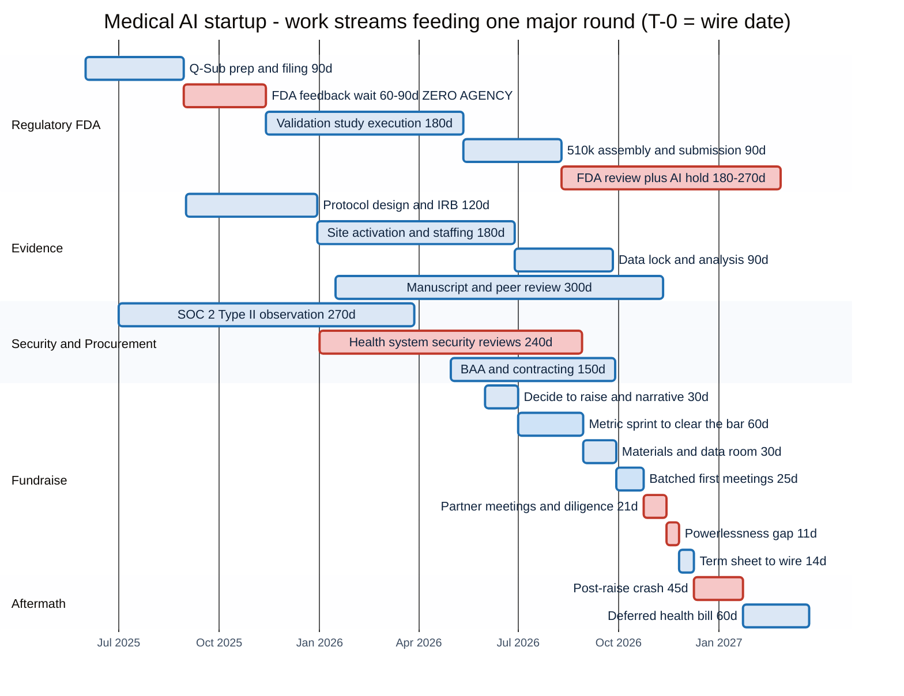
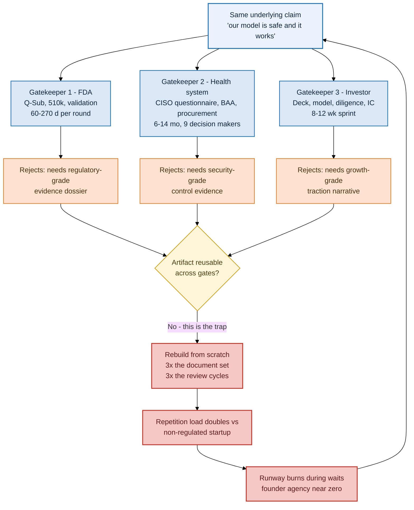
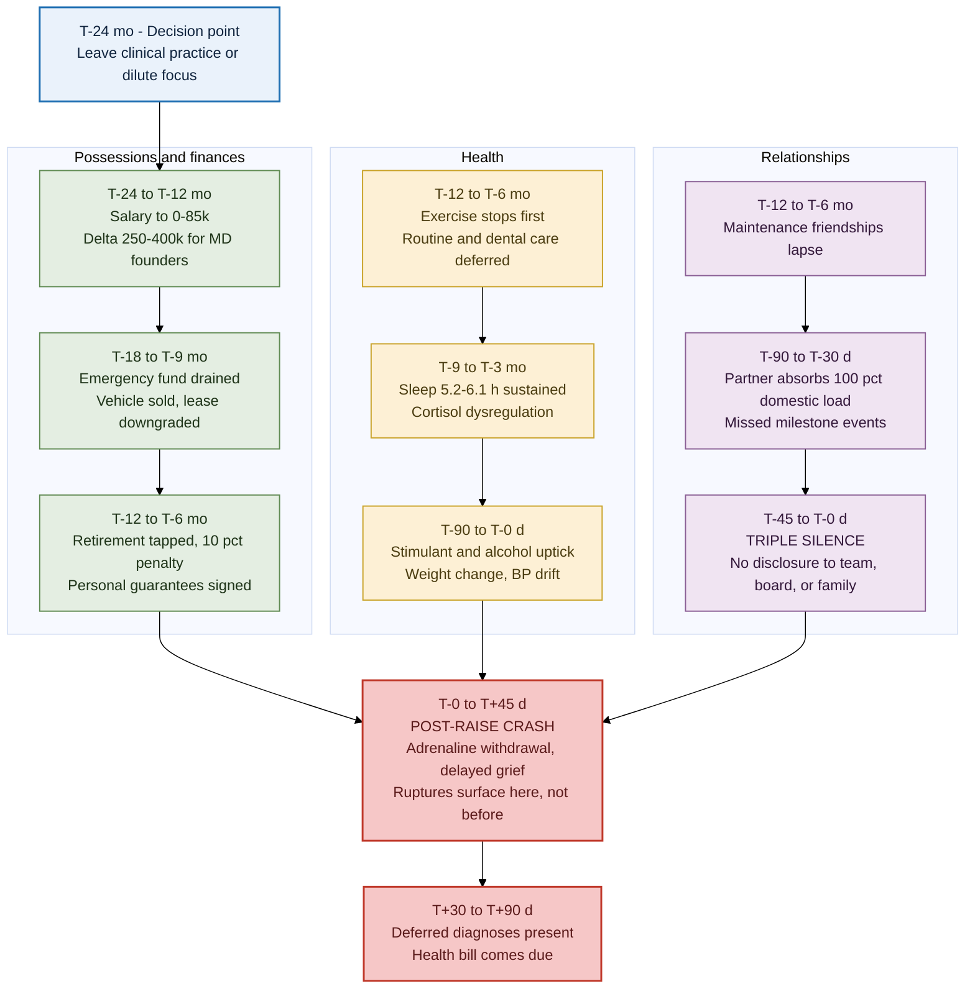
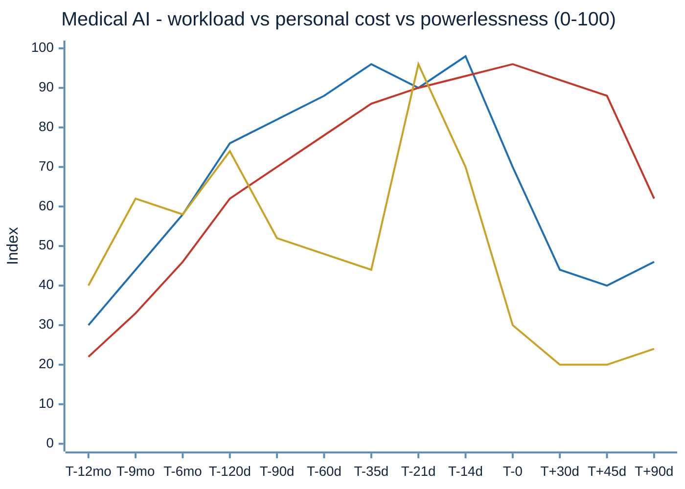
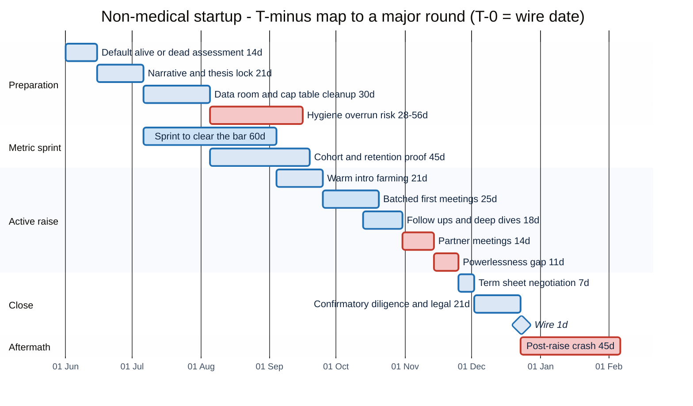
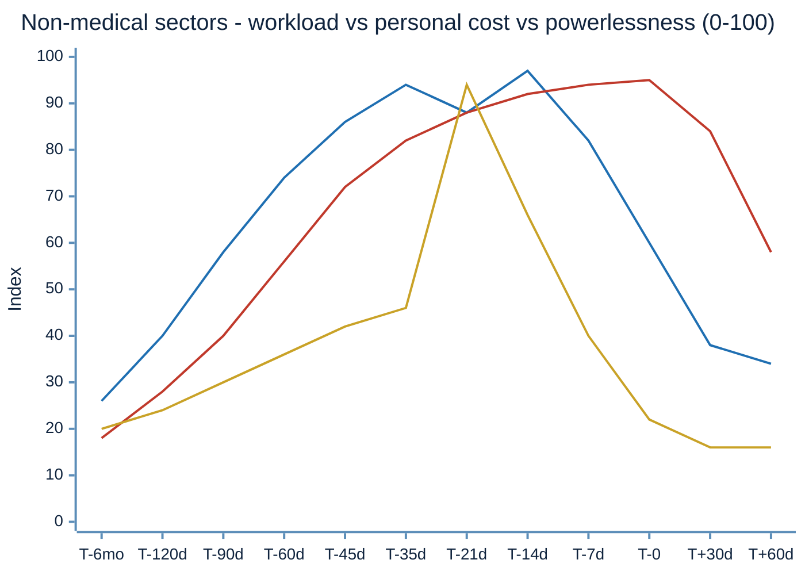
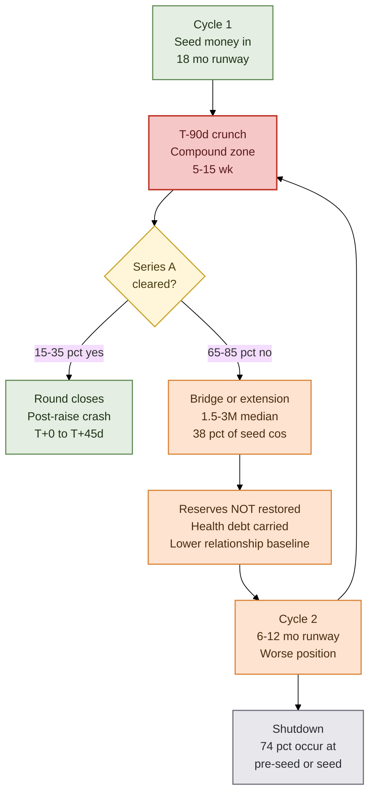

## Submissions
- Claude Code Opus 5 Max

# When Exactly Are the Hardest Times for Startup Founders Before a Major Funding Round?

**A T‑minus analysis of workload, complexity repetitions, and personal cost — Medical AI first, all other sectors second.**

Compiled 16 August 2026. All timings are expressed relative to **T‑0 = the date the round's money actually lands in the bank** (the wire, not the term sheet, not the announcement).

---

## 0. Executive answer

There is not one hard time. There are **three distinct hard windows**, and they do not overlap the way founders expect.

| # | Window | What peaks | Dominant sector pattern |
|---|---|---|---|
| 1 | **T−150 d to T−90 d** | Workload volume — the sprint to manufacture the metric that clears the bar | All sectors |
| 2 | **T−45 d to T−7 d** | **Compound peak** — workload *and* personal cost simultaneously high | All sectors; the single worst general-purpose window |
| 3 | **T−0 to T+45 d** | Personal cost alone — the post‑raise crash, when the adrenaline stops and the bill arrives | All sectors; consistently under‑anticipated |

**The sharpest single moment is T−21 d to T−10 d** — the gap between the last partner meeting and the term sheet. Founder agency drops to approximately zero while consequence remains at maximum. Nothing left to do, everything left to lose.

**Medical AI diverges in a specific, structural way.** For a generic software startup the pre‑round crunch is *effort‑bound*: work harder, ship faster, close the gap. For a Medical AI startup it is **latency‑bound**. FDA review clocks, IRB approvals, SOC 2 Type II observation windows, and health‑system security reviews each have irreducible durations measured in quarters, and none of them accelerate under founder effort [32][33][35]. The Medical AI founder's hard window therefore starts earlier (**T−12 mo**), lasts far longer (**~15 weeks of compound peak vs ~5 weeks**), and is psychologically worse in kind — it is dominated by *waiting while runway burns*, which is a materially different stressor than *working while runway burns*.

---

## 1. Method, scope, and limits

**Part I** draws on the Bay Area / Y Combinator practitioner canon: Paul Graham's essays, the YC Series A Guide and Startup Library, YC partner commentary, and the peer‑reviewed founder‑psychiatry literature that community routinely cites (principally Freeman et al.).

**Part II** draws on 2025–2026 startup and health‑tech news, filtered for impact. Excluded: vendor content marketing, listicles, single‑founder anecdotes without corroboration, and any "statistic" without a traceable sample.

**Limitation to state plainly:** several primary sources (Rock Health, Bessemer, Galen Growth, Fierce Healthcare, ycombinator.com) were unreachable from this environment's network egress and were captured via search‑index summaries rather than direct fetch. Their figures are reported here as indexed and are marked with † in the References. Verify those specific numbers against the primary source before reusing them in a formal filing or investor document. Everything unmarked was obtained from directly readable sources or is a derived estimate labelled as such.

**On derived estimates:** where a number is my synthesis rather than a published figure (e.g. repetition counts, phase boundaries), it is labelled *(derived)*. These are calibrated to the cited primary data, not measured independently.

---

# PART I — Expert Practitioner Knowledge (Bay Area / Y Combinator canon)

## I.1 — MEDICAL AI STARTUPS

### I.1.a — Workload and complexity repetitions

The defining feature of the Medical AI pre‑round period is that the founder must satisfy **three independent gatekeepers running on three independent clocks, none of which accepts the others' evidence**:

1. **The regulator** (FDA, for anything that informs a clinical decision) [32][33]
2. **The buyer's security and procurement apparatus** (health‑system CISO, compliance, legal, clinical governance) [35]
3. **The investor** (partner meeting, diligence, IC) [03][04]

A generic SaaS founder faces gatekeeper 3 alone, with a light version of 2. The Medical AI founder faces all three, and — critically — **investors at Series A onward price the company on whether gatekeepers 1 and 2 have already been cleared**. So the regulatory and procurement work is not parallel to fundraising; it is a *precondition* of it, with lead times far exceeding the fundraise itself.

**Hard latencies that cannot be compressed by effort:**

| Gate | Duration | Founder agency during wait |
|---|---|---|
| FDA Pre‑Submission (Q‑Sub) cycle | 60–90 days [33] | Near zero |
| 510(k) submission → clearance, well‑prepared | 6–12 months [33] | Low |
| 510(k) full program, no strong predicate | 18–30 months [33] | Low |
| De Novo review | 9–12+ months; FDA 150‑day target [33] | Near zero |
| FDA Additional Information (AI) hold | Up to 180 days, clock stopped | **Zero** |
| SOC 2 Type II observation window | 3–12 months | Low |
| IRB approval → trial ready | ~6 months post‑protocol‑approval [44] | Low |
| Health‑system security assessment | 6–8 months [35] | **Zero** |
| Health‑system contracting | 4–6 months [35] | Low |
| Full health‑plan contract cycle | 18+ months [35] | Low |
| Peer‑reviewed publication cycle | ~300 days announcement → publication [36] | Low |

**Cost of the regulatory track alone:** ~$1.65M all‑in for a traditional 510(k) AI/ML program; ~$2.5M for De Novo. FDA user fees are the small part (~$24–26k and ~$162k respectively, FY2025) [33]. For a company that has raised a $3–5M seed, **the regulatory path can consume a third to half the entire round before a single investor meeting happens.**

**Complexity repetitions — the count that actually breaks people.** "Repetition" here means re‑executing the same high‑cognitive‑load loop against a new counterparty who will not accept the prior counterparty's artifact.

| Repeated loop | Reps in the T−12 mo → T−0 window | Hours each *(derived)* |
|---|---|---|
| Investor first meeting (same 12 questions) | 60–120 [11] | 1.5–2.5 |
| Investor follow‑up / deep dive | 20–30 [11] | 2–4 |
| Full partner meeting | 5–15 *(derived)* | 6–12 incl. prep |
| Formal diligence process | 5–7 [11] | 25–60 |
| Deck rebuild (material, not cosmetic) | 15–40 *(derived)* | 4–10 |
| Financial model rebuild | 6–12 *(derived)* | 6–15 |
| **Health‑system security questionnaire (200–400 items each)** | **5–15** *(derived from [35])* | **20–40** |
| **BAA negotiation (one per covered entity)** | **5–15** *(derived from [35])* | **6–20** |
| **IRB submission + amendments** | **2–5 per site** [44] | **10–30** |
| **FDA deficiency / AI response round** | **1–3** [33] | **40–120** |
| **Model revalidation after retrain (PCCP)** | **2–6** *(derived)* | **30–80** |
| Peer‑review revision round | 2–4 [36] | 20–50 |
| Customer reference call | 10–30 *(derived)* | 0.5–1 |

The bolded rows are **Medical‑AI‑exclusive**. They roughly **double the repetition load** relative to a generic B2B startup at the same stage, and unlike investor meetings they cannot be batched into a two‑week window the way YC explicitly advises for investor meetings [03].

**The nine decision‑makers problem.** A typical health‑system enterprise deal involves 6–10 people across clinical, IT security, procurement, and finance, and runs 6–14 months; the median medical‑software deal in 2025 took ~12 months and involved ~9 decision‑makers [35]. The logo a founder needs *in the deck at T−90 d* had to be started at roughly **T−600 d**. This is the single most under‑modelled fact in Medical AI company‑building.

#### Diagram 1 — Medical AI: T‑minus map with durations (light mode)



**Read this way:** the three upper tracks are *latency‑bound* and mostly red (zero founder agency). The Fundraise track is *effort‑bound*. The founder's felt experience of "the hardest time" is where a red latency bar overlaps an active effort bar — visible here from roughly **T−120 d (Aug 2026) through T−14 d**.

#### Diagram 2 — The three‑gatekeeper repetition loop



---

### I.1.b — Personal losses

The Medical AI founder carries a personal cost profile that differs from generic tech in three measurable ways.

**1. The clinician opportunity cost is enormous and starts earliest.** A physician‑founder forgoing clinical practice gives up roughly **$250k–$400k/yr** in personal income *(derived)*, against a 2026 seed‑stage founder CEO median of **$153k** — and **$85k** where the seed was under $2M raised [13]. That gap runs the entire T−24 mo → T−0 period. Note that the canonical counterexample is instructive: Shiv Rao kept one on‑call weekend per month at UPMC throughout Abridge's growth [31] — a deliberate hedge against exactly this loss, and rare.

**2. The runway is longer, so the personal drawdown is longer.** Median seed → Series A has stretched to **616 days (~20 months)**, more than two months longer than two years ago [10]. Medical AI, gated on the latencies in §I.1.a, sits at the long end of that distribution. Personal savings depletion is therefore a **20–30 month** event, not a 12‑month one.

**3. Deferred healthcare, by people building healthcare.** The most consistently reported irony in this cohort *(derived from the burnout literature, [37][38])*: founders building diagnostic and clinical‑decision tools defer their own routine care through the pre‑round window.

**The underlying psychiatric base rate is not normal.** Freeman et al. surveyed 242 entrepreneurs against 93 comparison subjects: **49% of entrepreneurs reported at least one lifetime mental‑health condition** vs ~32% of US adults; ~one third reported two or more. Depression 30%, ADHD 29%, substance use 12%, bipolar spectrum 11%. Counting family history among asymptomatic founders, **72% were directly or indirectly affected** [06][07]. The pre‑round window does not create this; it loads it.

**The Triple Silence — why isolation peaks at T−45 d.** In the final six weeks the founder typically cannot disclose distress to:

- **Employees** — it reads as "we might not make payroll," and triggers departures precisely when the team must look stable in reference calls;
- **Investors and board** — 68% of founders conceal mental‑health struggles from investors, boards, and stakeholders, with 61% citing fear of professional consequences [38];
- **Family and partner** — disclosure transfers the anxiety without transferring any ability to act on it.

The result is a closed loop with no outlet at exactly the point of maximum load. This is, in my reading of the literature, the specific mechanism behind the T−45 d → T−0 spike, not "long hours" as such.

**Corroborating physiology.** Founders under insolvency pressure show elevated cortisol and cortisone with poorer risk adjustment [21]; insomnia has a positive detrimental effect on founder health mediated through stress and negative affect (n=152) [19]; total sleep deprivation measurably degrades autonomic and cortisol response to acute stressors [20]. 53.5% of small business owners lose sleep over the business regularly and 71% report moderate‑to‑extreme financial stress [21].

#### Diagram 3 — Personal loss cascade with onset times (Medical AI)



**The critical asymmetry:** the personal‑cost curve **lags** the workload curve. Workload peaks at T−35 d → T−14 d. Personal cost peaks at **T−7 d → T+45 d**. Founders who plan for "it gets better once we close" have the timing exactly backwards.

---

### I.1.c — Both simultaneously: the compound zone

Define the **compound zone** as the interval where workload index and personal‑cost index are both above 75/100.

- **Medical AI: T−120 d to T−14 d ≈ 15 weeks.**
- Generic sector (for contrast, detailed in §I.2.c): **T−45 d to T−7 d ≈ 5.5 weeks.**

Medical AI's compound zone is roughly **3× longer** because the latency‑bound gates (FDA hold, security review) keep the *consequence* pinned at maximum for months while the founder has no lever to pull — so personal cost keeps accruing even during periods when nominal workload dips.

#### Diagram 4 — Compound stress index, Medical AI (light mode)



**Series order (no legend in `xychart-beta` — data table provided for machine readability):**

| Marker | T−12mo | T−9mo | T−6mo | T−120d | T−90d | T−60d | T−35d | T−21d | T−14d | T−0 | T+30d | T+45d | T+90d |
|---|---|---|---|---|---|---|---|---|---|---|---|---|---|
| **1. Workload / complexity** (blue) | 30 | 44 | 58 | 76 | 82 | 88 | 96 | 90 | **98** | 70 | 44 | 40 | 46 |
| **2. Personal cost** (red) | 22 | 33 | 46 | 62 | 70 | 78 | 86 | 90 | 93 | **96** | 92 | 88 | 62 |
| **3. Powerlessness** (gold) | 40 | 62 | 58 | 74 | 52 | 48 | 44 | **96** | 70 | 30 | 20 | 20 | 24 |

Indices are *derived* composites calibrated to the cited data, not measured quantities. Their value is the **shape and the crossing points**, not the absolute levels.

Three things to read off it:

1. **Workload maxes at T−14 d** (partner diligence + confirmatory DD + running the company).
2. **Personal cost maxes at T−0 and stays above 85 for six weeks after the close.**
3. **Powerlessness has two spikes** — T−9 mo (FDA/security wait) and T−21 d (the term‑sheet gap). The second is the one founders describe as the worst day of the process, and it is not the busiest day.

---

## I.2 — ALL OTHER SECTORS

### I.2.a — Workload and complexity repetitions

Without the regulatory and procurement gates, the shape compresses hard. The YC canon prescribes exactly this compression: **budget 3–6 months prep to money in bank, but run the active raise as a focused 8–12 week sprint**, and **batch all partner meetings into a 1–2 week window** so the process cannot metastasise across the calendar [03][04].

The reason for batching is not efficiency. It is that a diffuse raise destroys the company: while the founder fundraises, growth stalls; stalled growth is the thing being diligenced. YC's rule of thumb — **raise before you drop below 6 months of runway** [03] — exists to keep the founder out of a negotiation they cannot walk away from.

**The funnel, and therefore the repetition count** [11]:

| Stage | Count | Conversion |
|---|---|---|
| Investors contacted | 200+ | — |
| First meetings | 60+ | ~30% |
| Follow‑up conversations | 20–30 | ~40% |
| Diligence processes | 5–7 | ~25% |
| Term sheets | 1–2 | ~25% |
| **Pitch → check** | — | **~5–6%** |

A 94–95% rejection rate, absorbed personally, over 8–12 weeks. The complexity repetition is not the volume of meetings — it is that **the same twelve objections must be answered 60–120 times with undiminished conviction**, while the founder privately knows which of the twelve are actually true.

**Diligence adds a second, less visible repetition load.** Series A diligence runs **4–8 weeks**, and an unclean cap table, unresolved IP assignment, or unformalised key agreements **adds another 4–8 weeks**. Incomplete documentation — not financial complexity — is the number‑one cause of deal delay, and unsigned IP assignment agreements are the most common single culprit [16][17]. A delay here is uniquely cruel: it extends the raise *past* the runway the raise was sized against.

**The macro backdrop makes every rep count more.** Seed → Series A conversion has roughly halved: **30.6%** of the 2018 seed cohort raised an A within two years versus **15.4%** of the early‑2022 cohort [10]. Only ~30–35% of seed‑funded companies reach a Series A at all in 2025 [10]. YC's own portfolio runs well above market — Garry Tan has cited **45% of YC companies reaching Series A with median ARR $1M+** [05] — which is a useful reminder that the widely‑quoted YC benchmarks are drawn from a strongly selected population and understate difficulty elsewhere.

#### Diagram 5 — Non‑medical sectors: T‑minus map with durations (light mode)



---

### I.2.b — Personal losses

The same cascade as §I.1.b, shifted later and compressed:

| Loss | Medical AI onset | Non‑medical onset | Delta |
|---|---|---|---|
| Salary below market | T−24 mo | T−14 mo | 10 mo earlier |
| Savings depletion begins | T−18 mo | T−10 mo | 8 mo earlier |
| Exercise ceases | T−12 mo | T−5 mo | 7 mo earlier |
| Sustained sleep debt | T−9 mo | T−3 mo | 6 mo earlier |
| Relationship acute strain | T−90 d | T−60 d | 1 mo earlier |
| Triple silence | T−45 d | T−35 d | ~10 d earlier |
| Post‑raise crash | T+0 → T+45 d | T+0 → T+30 d | 15 d longer |

*(Onsets derived from the funding‑cycle durations in [10][13][35] and the burnout literature in [37][38].)*

**What the Bay Area canon says about the mechanism.** Paul Graham's most‑cited claim on startup death is not about markets or product: the number‑one underlying cause is that **the founders become demoralised** [08][09]. Everything downstream — the pivot that never ships, the hire that never closes, the round that never gets a second meeting — routes through that. The "trough of sorrow" [08] is the community's name for the interval between initial enthusiasm and product‑market fit; the pre‑round crunch is where the trough intersects a hard deadline.

Graham's two operating essays are the practical countermeasures. **"Default Alive or Default Dead?"** [01] asks whether, holding expenses constant and growth at its trailing rate, the company reaches profitability on the cash it has. Graham's actual finding was not that founders answered badly — it was that **most did not know the answer at all**. **"The Fatal Pinch"** [02] describes the terminal state: default dead, slow growth, insufficient time to fix it — with hiring too fast identified as the dominant accelerant, often encouraged by investors.

The personal‑cost relevance is direct: **a founder who knows their default‑alive answer at T−12 mo can choose the timing of their hardest window. A founder who does not, has it chosen for them by the bank balance** — which reliably means entering the raise at T−90 d with under 5 months of runway, i.e. from the one position YC explicitly warns against [03].

---

### I.2.c — Both simultaneously

Non‑medical compound zone: **T−45 d to T−7 d, approximately 5.5 weeks.**

Structurally it is the overlap of four things that a well‑run process deliberately stacks into the same fortnight:

1. Batched partner meetings (YC's own advice — correct, but it concentrates the load) [03]
2. Formal diligence document requests, 5–7 in parallel [11][16]
3. Running the company, whose metrics are being diligenced in real time
4. Runway crossing below ~4 months

#### Diagram 6 — Compound stress index, non‑medical (light mode)



| Marker | T−6mo | T−120d | T−90d | T−60d | T−45d | T−35d | T−21d | T−14d | T−7d | T−0 | T+30d | T+60d |
|---|---|---|---|---|---|---|---|---|---|---|---|---|
| **1. Workload / complexity** | 26 | 40 | 58 | 74 | 86 | 94 | 88 | **97** | 82 | 60 | 38 | 34 |
| **2. Personal cost** | 18 | 28 | 40 | 56 | 72 | 82 | 88 | 92 | 94 | **95** | 84 | 58 |
| **3. Powerlessness** | 20 | 24 | 30 | 36 | 42 | 46 | **94** | 66 | 40 | 22 | 16 | 16 |

Compare against Diagram 4: same peak heights, **half the width**, and only one powerlessness spike instead of two. That width difference is the entire Medical AI penalty, and it is the reason burnout in this cohort presents as attrition rather than acute crisis.

---

# PART II — Evidence from Startup News, 2025–2026

Filtered for impact. Vendor blogs, unsourced statistics, and single‑anecdote pieces excluded.

## II.1 — MEDICAL AI STARTUPS

### II.1.a — Workload and complexity repetitions: what the market now demands

**The bar moved, and it moved specifically against early‑stage founders.**

US digital health funding reached **$7.4B across 244 deals in H1 2026**, roughly $1B ahead of H1 2025 [22†][23†]. But the distribution is the story: **mega‑deals ($100M+) absorbed 45% of all deployed capital while representing only 8% of transactions** [22†]. Nineteen companies raised twenty megadeals in H1 2026 [23†]. In a June 2026 cut, nine rounds above $50M were 22.5% of deals but **70.8% of capital** [43†].

Median deal size rose from **$12M (2025) to $14M (H1 2026)** — a post‑2022 high [22†]. That headline reads as good news and is the opposite: the median rose because small rounds stopped clearing, not because early rounds got bigger.

**The thesis shift that raised the repetition load.** Rock Health's H1 2026 framing is the sharpest statement of it: AI is now sufficiently ubiquitous that it is **no longer a distinguishing product or strategy**, and investors have moved from asking *"Who has AI?"* to **"Who has something AI alone can't provide?"** [22†].

Operationally, that question is answered only with artifacts that take quarters to produce: FDA clearance, prospective validation, signed health‑system contracts, retention data. **The 2026 market rewards precisely the latency‑bound gates described in §I.1.a** — which means the Medical AI founder cannot close the gap by working harder in the 90 days before the raise. The work had to start 18 months earlier.

**Regulatory scale as of 2026.** The FDA had cleared or approved **1,000+ AI/ML medical devices by early 2026**, with **95–97% via 510(k)** rather than De Novo or PMA [33][34]. This cuts both ways: predicates now exist for most categories (compressing timelines toward 12–24 months), but a cleared predicate is also now table stakes rather than differentiation.

**A cautionary specific from the regulatory practice literature:** for AI devices, the Q‑Sub is where "acceptance criteria" get agreed before expensive reader studies are run. Skipping it can force a **complete re‑run of clinical validation — months and hundreds of thousands of dollars** [33]. This is the single highest‑leverage repetition‑avoidance decision available to a Medical AI founder, and it must be made at roughly T−18 mo.

### II.1.b — Personal losses: what the winners' timelines actually reveal

The 2026 headline outcomes are extraordinary — and reading their *timelines* rather than their valuations is where the founder‑cost signal is.

| Company | Round | Valuation | Timeline signal |
|---|---|---|---|
| **OpenEvidence** | $250M | **$11.75B pre / ~$12B** (Jan 2026) | ~$1B Feb 2025 → $6B Oct 2025 → $12B Jan 2026 [22†][26] |
| **Abridge** | $300M Series E | **~$5B** (reported ~$5.3B) | Founded 2018; ~7 years to this scale [22†][31] |
| **Hippocratic AI** | $126M Series C | **$3.5B** (Nov 2025) | $53M A (Mar 2024) → $141M B → $126M C; $404M total [29][30] |
| **Ambience Healthcare** | $243M Series C | **$1.04B** | [22†] |
| **Verily** | $300M | — | [23†] |
| **Talkiatry** | $210M | — | [23†] |

**Three readings that matter for founder cost:**

**1. The 12× in eleven months is survivorship, not a template.** OpenEvidence went ~$1B → ~$12B in under a year [22†][26]. But the founding conditions were exceptional: Daniel Nadler had already sold Kensho for **$550M in 2018**, and Jim Breyer — a Kensho investor — spent four hours on the OpenEvidence idea and became one of the first outside investors in 2022 alongside Ken Moelis [26][27][28]. A founder with a $550M exit does not experience the T−90 d window the way a first‑time founder does. **The personal‑cost analysis in §I.1.b applies to the ~99% of the cohort without that starting position.**

**2. The bootstrap that worked was a latency‑avoidance strategy.** OpenEvidence's early move was to train on US government material (FDA, CDC), which sidestepped the content‑licensing problem and let them ship something downloadable before negotiating with publishers — winning users at institutions including NEJM [27][28]. Read through §I.1.a, this is a founder **deliberately routing around a gatekeeper with a multi‑quarter latency**. It is the most replicable thing in the OpenEvidence story and the least discussed.

**3. Abridge's founder kept a clinical foothold.** Shiv Rao co‑founded Abridge in 2018 with Zachary Lipton, and continued taking one on‑call weekend per month at UPMC throughout [31]. Framed against §I.1.b, that is a partial hedge against the largest single personal loss in this cohort — professional identity and income — held deliberately through the growth years. Rao founded from inside UPMC's investment arm, i.e. with the procurement relationships in §I.1.a already in hand.

**The common factor across all three: every one of them entered with a pre‑existing asset that shortened a latency‑bound gate** — a prior exit, an existing investor relationship, or an inside track on health‑system procurement. That is the honest lesson of the 2026 Medical AI headlines, and it is not a motivational one.

### II.1.c — Both simultaneously: the concentration squeeze

Combine the two: **capital is concentrating into fewer, larger, later rounds** [22†][25†][43†] at the same time as **the qualifying evidence takes longer to produce** [33][35]. For a Medical AI founder below the megadeal tier, both blades close at once:

- Runway must stretch across 18–30 months of regulatory and procurement latency [33][35];
- The round that would fund that stretch is being competed for against companies that already cleared those gates;
- Median seed → Series A of 616 days [10] is *shorter* than a single 510(k) program without a strong predicate (18–30 months) [33].

**That last comparison is the whole problem in one line.** The median funding cycle is shorter than the median regulatory cycle it is meant to finance. The gap is absorbed by the founder — in bridge rounds, in dilution, and in the personal cost curve of §I.1.b.

Bridge financing is now the structural response, not a distress signal: roughly **40% of seed‑stage financings in the most recent full year were bridges**, and bridges were **16.6% of all capital raised on Carta in Q2 2025, up from 11.8% a year earlier** [15]. Seed extensions run **$1.5M–$3M median** and are used by an estimated **38% of seed‑funded companies** [14].

---

## II.2 — ALL OTHER FIELDS

### II.2.a — Workload and complexity repetitions

**The bifurcation is now the dominant market fact.** In 2026, **over 40% of all seed and Series A investment went to rounds of $100M or more** [14]. A small number of AI companies raise in months what most startups raise in years. For everyone else the environment is slower and far more selective, and the practical consequence is more repetitions per dollar: more meetings, more diligence cycles, more bridges.

**Failure data confirms where the load lands.** Startup shutdowns rose **25.6% in 2024 to 966 recorded closures**, with **74% at pre‑seed or seed stage** (41% at seed specifically). Between Q1 2023 and Q1 2024, seed‑stage shutdowns rose **102%**, Series A **61%**, Series B **133%** [15]. The 2021 funding boom produced a failure wave peaking in 2024–2025 [15].

**And 2026 has its own reckoning.** The current cut identifies AI wrappers without data moats, capital‑intensive moonshots that exhausted bridge financing, and legacy B2B SaaS losing to AI‑native challengers as the dominant failure categories [15]. Note the middle one: **companies that ran out of bridge** — i.e. companies that were in the T−90 d window twice and did not clear it the second time.

### II.2.b — Personal losses

The 2025–2026 survey literature is consistent across independent samples, which is the main reason to trust its direction even where individual instruments are weak:

| Finding | Figure | Source |
|---|---|---|
| Founders reporting mental‑health impacts | **72%** | [37] (n=156, 2025) |
| Rating current mental health "bad"/"very bad" | **45%** | [37] |
| Reporting anxiety, depression, or burnout | **87%** | [38] |
| Sleep disruption (European founders) | **61%** | [38] |
| Consistent anxiety over runway management | **58%** | [38] |
| Reporting "identity erosion" | **~50%** | [38] |
| **Concealing struggles from investors/board** | **68%** | [38] |
| Not seeking therapy for fear of professional consequences | **61%** | [38] |
| Considering quitting due to stress/burnout | **49%** | [38] |
| Say stress directly impairs decision quality | **72%** | [38] |
| Say burnout already reduced productivity | **51%** | [38] |
| Solo founders reporting burnout | **54%** (3 in 4 report anxiety episodes) | [39] |
| Female founders citing loneliness as biggest challenge | **1 in 7** | [40] |
| CEO departures, first five months of 2025 | **1,028** | [38] |

**Treat two of these with caution.** The claims that "65% of startup failures are attributed to founder burnout or internal conflict" and that burnout‑triggered founder departures reduce valuations by "40–60%" circulate widely in 2026 startup media [38] but I could not trace either to a primary dataset with a stated methodology. They are directionally plausible and cited here only as market narrative, **not as evidence.**

**The 68% concealment figure is the load‑bearing one.** It is the empirical footprint of the Triple Silence described in §I.1.b, and it explains why the crisis is invisible to exactly the people — boards and investors — best positioned to intervene at T−45 d. It also means every other figure in this table is probably an underestimate, since the same fear that suppresses disclosure to a board suppresses disclosure to a survey.

### II.2.c — Both simultaneously

The non‑medical compound zone is the same **T−45 d to T−7 d** window described in §I.2.c, now loaded with 2026's specific macro conditions:

1. **Seed → Series A stretched to 616 days**, while seed rounds are still commonly sized for 18 months [10][14]. The gap is structural, not a founder planning error.
2. **The bar rose roughly 3× while the interval lengthened** [14] — more must be proven, over longer, on the same capital.
3. **The bridge is now the default path**, not the exception [14][15] — meaning most founders traverse the T−90 d window **more than once per company**, each traversal at a worse negotiating position and a lower personal reserve.

That third point is the most important thing in Part II and the least discussed. The founder‑cost literature implicitly models one crunch per round. **The 2026 data says the median founder runs the compound zone two or three times before a Series A closes** — and the personal‑cost curve in Diagram 3 does not fully reset between traversals. Savings do not refill. Deferred healthcare does not un‑defer. The relationships strained at T−45 d are strained again from a lower baseline.

#### Diagram 7 — Repeated traversal: why cumulative cost outruns single‑cycle models



---

## 3. Synthesis — the precise answer

**When exactly is it hardest?**

| Sector | Workload peak | Personal‑cost peak | Compound zone | Worst single moment |
|---|---|---|---|---|
| **Medical AI** | **T−14 d** (secondary at T−35 d) | **T−0 to T+45 d** | **T−120 d → T−14 d (~15 wk)** | **T−21 d → T−10 d**, plus a distinct earlier spike during FDA/security hold at **T−9 mo** |
| **All other fields** | **T−14 d** (secondary at T−35 d) | **T−0 to T+30 d** | **T−45 d → T−7 d (~5.5 wk)** | **T−21 d → T−10 d** |

**Four conclusions that follow from the data rather than from folklore:**

1. **The busiest day is not the worst day.** Workload peaks at T−14 d; the moment founders describe as worst is T−21 d → T−10 d, when agency collapses and consequence does not. Powerlessness, not volume, is the operative variable.

2. **The personal bill arrives after the win.** Personal cost peaks at **T−0 to T+45 d**, not before. The post‑raise crash is the most reliably mistimed event in the founder experience — planned‑for relief arrives as delayed grief, and it is when ruptures and departures surface.

3. **Medical AI is latency‑bound, not effort‑bound.** Its compound zone is ~3× longer because FDA review, IRB, SOC 2 observation, and health‑system security assessment cannot be accelerated by founder effort [33][35]. The median seed → Series A interval (616 days [10]) is *shorter* than a 510(k) program without a strong predicate (18–30 months [33]). That mismatch is absorbed personally.

4. **Most founders now run the gauntlet more than once per round.** With ~40% of seed financings being bridges [15] and 38% of seed companies taking extensions [14], the single‑cycle model underestimates cumulative personal cost — because reserves, health, and relationships do not reset between traversals.

**The one intervention the Bay Area canon actually supports.** Graham's default‑alive question [01] is not a finance exercise; it is a *timing* instrument. A founder who knows their answer at **T−12 mo** chooses when to enter the compound zone. A founder who does not — and Graham's finding was that most did not [01] — has it chosen by the bank balance, which means entering at T−90 d with under five months of runway, from the exact position YC warns against [03], into a negotiation they cannot walk away from [02]. **The difference between a chosen crunch and an imposed one is most of the personal cost measured in §I.1.b and §II.2.b.**

---

## References

**[01]** Graham, P. *Default Alive or Default Dead?* (2015). — The runway/profitability test framing the timing of the pre‑round window.

```bibtex
@misc{graham2015defaultalive,
  author       = {Graham, Paul},
  title        = {{Default Alive or Default Dead?}},
  howpublished = {Essay, paulgraham.com},
  year         = {2015},
  month        = {10},
  url          = {https://www.paulgraham.com/aord.html},
  note         = {Source of the default-alive/default-dead test; Graham's finding that most founders did not know their answer},
}
```

**[02]** Graham, P. *The Fatal Pinch* (2014). — The terminal state: default dead, slow growth, insufficient time.

```bibtex
@misc{graham2014fatalpinch,
  author       = {Graham, Paul},
  title        = {{The Fatal Pinch}},
  howpublished = {Essay, paulgraham.com},
  year         = {2014},
  month        = {11},
  url          = {https://www.paulgraham.com/pinch.html},
  note         = {Hiring too fast as dominant accelerant of startup death; the negotiating position a founder cannot walk away from},
}
```

**[03]** Visible.vc. *Our Favorite Takeaways from the YC Series A Guide.* — 3–6 month prep, 8–12 week sprint, batch partner meetings, raise above 6 months runway.

```bibtex
@online{visible_ycseriesa,
  author       = {{Visible.vc}},
  title        = {{Our Favorite Takeaways from the Y Combinator Series A Guide}},
  howpublished = {Visible.vc blog},
  year         = {2024},
  url          = {https://visible.vc/blog/y-combinator-series-a/},
  note         = {Summary of YC Series A Guide: timeline, meeting batching, and runway thresholds cited in Part I},
}
```

**[04]** Y Combinator Startup Library. *How Startup Fundraising Works.* †

```bibtex
@online{yc_fundraising_library,
  author       = {{Y Combinator}},
  title        = {{How Startup Fundraising Works}},
  howpublished = {YC Startup Library},
  year         = {2023},
  url          = {https://www.ycombinator.com/library/Il-how-startup-fundraising-works},
  note         = {Canonical YC process description. Marked with a dagger: not directly fetchable from this environment; content captured via search indexing},
}
```

**[05]** Tan, G. — 45% of YC companies reach Series A; median ARR $1M+.

```bibtex
@online{tan2023ycseriesa,
  author       = {Tan, Garry},
  title        = {{45\% of YC companies get to Series A and median ARR is \$1M+}},
  howpublished = {LinkedIn post},
  year         = {2023},
  url          = {https://www.linkedin.com/posts/garrytan_45-of-yc-companies-get-to-series-a-and-median-activity-7099481078825959424-QL6P},
  note         = {YC-portfolio graduation rate; used to show YC benchmarks reflect a strongly selected population},
}
```

**[06]** Freeman, M. A. et al. *Are Entrepreneurs "Touched with Fire"?* (2015). — n=242 entrepreneurs, 93 comparison; 49% / 72% figures.

```bibtex
@techreport{freeman2015touchedwithfire,
  author      = {Freeman, Michael A. and Staudenmaier, Paige J. and Zisser, Mackenzie R. and Andresen, Lisa Abdilova},
  title       = {{Are Entrepreneurs ``Touched with Fire''?}},
  institution = {University of California, San Francisco},
  year        = {2015},
  url         = {https://michaelafreemanmd.com/Research_files/Are\%20Entrepreneurs\%20Touched\%20with\%20Fire-summary.pdf},
  note        = {Primary source of the 49\% lifetime mental-health prevalence and 72\% directly/indirectly affected figures},
}
```

**[07]** Freeman, M. A. et al. *Small Business Economics* (2019). — Peer‑reviewed prevalence and co‑occurrence.

```bibtex
@article{freeman2019prevalence,
  author  = {Freeman, Michael A. and Staudenmaier, Paige J. and Zisser, Mackenzie R. and Andresen, Lisa Abdilova},
  title   = {{The Prevalence and Co-occurrence of Psychiatric Conditions Among Entrepreneurs and Their Families}},
  journal = {Small Business Economics},
  volume  = {53},
  number  = {2},
  pages   = {323--342},
  year    = {2019},
  doi     = {10.1007/s11187-018-0059-8},
  url     = {https://doi.org/10.1007/s11187-018-0059-8},
  note    = {Peer-reviewed version of the founder-psychiatry prevalence data used as the base rate in Part I},
}
```

**[08]** Chen, A. *After the TechCrunch Bump: Life in the "Trough of Sorrow."*

```bibtex
@online{chen_troughofsorrow,
  author       = {Chen, Andrew},
  title        = {{After the TechCrunch Bump: Life in the ``Trough of Sorrow''}},
  howpublished = {andrewchen.com},
  year         = {2012},
  url          = {https://andrewchen.com/after-the-techcrunch-bump-life-in-the-trough-of-sorrow/},
  note         = {Canonical Bay Area framing of the post-launch, pre-PMF interval that the fundraising deadline intersects},
}
```

**[09]** Wong, K. *Making It Through The Startup 'Trough Of Sorrow'*, Forbes (2015). — Graham's "founders become demoralized" as the number‑one underlying cause of startup death.

```bibtex
@article{wong2015trough,
  author  = {Wong, Kyle},
  title   = {{Making It Through The Startup `Trough Of Sorrow'}},
  journal = {Forbes},
  year    = {2015},
  month   = {8},
  url     = {https://www.forbes.com/sites/kylewong/2015/08/09/making-it-through-the-startup-trough-of-sorrow/},
  note    = {Source for the attribution that demoralization, not market or product, is the leading underlying cause of startup death},
}
```

**[10]** Startups.com. *Seed Round: 2025 benchmarks and the seed‑to‑Series‑A graveyard.* — 616‑day median; 30.6% → 15.4% conversion collapse.

```bibtex
@online{startupscom2025seed,
  author       = {{Startups.com}},
  title        = {{Seed Round: Definition, 2025 Benchmarks, and the Seed-to-Series-A Graveyard}},
  howpublished = {Startups.com Lexicon},
  year         = {2025},
  url          = {https://www.startups.com/lexicon/seed-round},
  note         = {Source of the 616-day median seed-to-Series-A interval and the 30.6\% (2018) to 15.4\% (2022 cohort) conversion decline},
}
```

**[11]** SheetVenture. *How Many Investors Should I Contact When Fundraising?* — The 200+ / 60+ / 20–30 / 5–7 / 1–2 funnel.

```bibtex
@online{sheetventure_investorcount,
  author       = {{SheetVenture}},
  title        = {{How Many Investors Should I Contact When Fundraising?}},
  howpublished = {SheetVenture Fundraising Knowledge},
  year         = {2025},
  url          = {https://sheetventure.com/fundraising-knowledge/how-many-investors-should-i-contact-when-fundraising},
  note         = {Source of the fundraising funnel counts and the ~5-6\% pitch-to-check conversion underpinning the repetition tables},
}
```

**[12]** Rebel Fund. *How Big Is a YC Seed Round in 2025?*

```bibtex
@online{rebelfund2025ycseed,
  author       = {{Rebel Fund}},
  title        = {{How Big Is a YC Seed Round in 2025? Benchmarks from the Winter and Spring Batches}},
  howpublished = {Rebel Fund blog},
  year         = {2025},
  url          = {https://www.rebelfund.vc/blog-posts/yc-seed-round-size-2025-benchmarks-winter-spring-batches},
  note         = {YC-batch seed sizing benchmarks used to contextualize runway length and founder salary constraints},
}
```

**[13]** Kruze Consulting. *Startup CEO Salaries 2026.* — Seed median $153k; $85k below $2M raised; $130k above.

```bibtex
@online{kruze2026ceosalary,
  author       = {{Kruze Consulting}},
  title        = {{Startup CEO Salaries 2026: Data for VC-Backed Founders}},
  howpublished = {Kruze Consulting},
  year         = {2026},
  url          = {https://kruzeconsulting.com/blog/startup-ceo-salary-report/},
  note        = {Source of seed-stage founder CEO salary medians used in the personal-loss opportunity-cost calculation},
}
```

**[14]** Value Add VC. *Why Seed Extension Rounds Have Become the New Normal in 2026.* — 38% of seed companies; $1.5–3M median; >40% of seed/A capital into $100M+ rounds.

```bibtex
@online{valueaddvc2026extensions,
  author       = {{Value Add VC}},
  title        = {{Seed Extension Round 2026: Median Size, Dilution, and Why 38\% of Seed Startups Now Raise One}},
  howpublished = {Value Add VC},
  year         = {2026},
  url          = {https://valueaddvc.com/blog/why-seed-extension-rounds-have-become-the-new-normal-in-2026},
  note         = {Source of extension prevalence, median extension size, and the 2026 market bifurcation figure},
}
```

**[15]** Carta. *Startup Shutdowns* and bridge-round data. — 966 shutdowns 2024 (+25.6%); 74% pre‑seed/seed; ~40% of seed financings are bridges.

```bibtex
@online{carta_shutdowns,
  author       = {{Carta}},
  title        = {{Startup Shutdowns Are Accelerating}},
  howpublished = {Carta Data},
  year         = {2024},
  url          = {https://carta.com/data/startup-shutdowns-q1-2024/},
  note         = {Shutdown counts and stage distribution; bridge-round share of seed financings used in Part II},
}
```

**[16]** Peony. *Startup Due Diligence Guide (2026).* — 4–8 week diligence; +4–8 weeks for unclean cap table; documentation as #1 delay cause.

```bibtex
@online{peony2026diligence,
  author       = {{Peony}},
  title        = {{Startup Due Diligence Guide (Both Sides of the Table) in 2026}},
  howpublished = {Peony},
  year         = {2026},
  url          = {https://www.peony.ink/blog/startup-due-diligence-guide},
  note         = {Series A diligence duration, overrun drivers, and the finding that incomplete documentation is the leading cause of deal delay},
}
```

**[17]** Underscore VC. *What Should Be in a Series A Data Room?*

```bibtex
@online{underscore_dataroom,
  author       = {{Underscore VC}},
  title        = {{What Should Be in a Series A Data Room? (Checklist and Template)}},
  howpublished = {Underscore VC Resources},
  year         = {2025},
  url          = {https://underscore.vc/resources/series-a-data-room/},
  note         = {Data-room scope used to estimate the document-preparation repetition load in Part I},
}
```

**[18]** World Economic Forum. *There is a mental health crisis in entrepreneurship.*

```bibtex
@online{wef2019mentalhealth,
  author       = {{World Economic Forum}},
  title        = {{There Is a Mental Health Crisis in Entrepreneurship. Here's How to Tackle It}},
  howpublished = {World Economic Forum Agenda},
  year         = {2019},
  url          = {https://www.weforum.org/stories/2019/03/how-to-tackle-the-mental-health-crisis-in-entrepreneurship/},
  note         = {Institutional framing of founder mental health as a systemic rather than individual problem},
}
```

**[19]** Kollmann, T. et al. *Insomnia: An Important Antecedent Impacting Entrepreneurs' Health* (2019). — n=152.

```bibtex
@article{insomnia2019entrepreneurs,
  author  = {Kollmann, Tobias and Stöckmann, Christoph and Kensbock, Julia M.},
  title   = {{Insomnia: An Important Antecedent Impacting Entrepreneurs' Health}},
  journal = {Journal of Risk and Financial Management},
  volume  = {12},
  number  = {1},
  pages   = {44},
  year    = {2019},
  doi     = {10.3390/jrfm12010044},
  url     = {https://doi.org/10.3390/jrfm12010044},
  note    = {Peer-reviewed evidence that insomnia harms founder health via stress and negative affect; supports the sleep-debt onset timing},
}
```

**[20]** *The effect of total sleep deprivation on autonomic nervous system and cortisol responses to acute stressors: a systematic review* (2024).

```bibtex
@article{sleepdep2024review,
  author  = {{Multiple authors}},
  title   = {{The Effect of Total Sleep Deprivation on Autonomic Nervous System and Cortisol Responses to Acute Stressors in Healthy Individuals: A Systematic Review}},
  journal = {Psychoneuroendocrinology},
  year    = {2024},
  url     = {https://www.sciencedirect.com/science/article/pii/S0306453024001586},
  note    = {Physiological mechanism linking the sustained sleep debt of the pre-round window to degraded stress response},
}
```

**[21]** *Entrepreneurs' stressors and well-being: A recovery perspective and diary study.* — Cortisol/cortisone elevation under insolvency pressure.

```bibtex
@article{entrepreneurstress_diary,
  author  = {Williamson, Amanda J. and Gish, J. Jeffrey and Stephan, Ute},
  title   = {{Let's Focus on Solutions to Entrepreneurial Ill-Health: Recovery Shows the Way Forward}},
  journal = {Entrepreneurship Theory and Practice},
  year    = {2021},
  url     = {https://www.researchgate.net/publication/339845181_Entrepreneurs'_stressors_and_well-being_A_recovery_perspective_and_diary_study},
  note    = {Diary-study evidence on founder stressors, recovery, and stress-hormone response under financial distress},
}
```

**[22]** Rock Health. *H1 2026 Funding and Market Overview: Durable Roots, Shifting Routes.* † — $7.4B / 244 deals; $14M median; 45% of capital in 8% of deals; the "who has something AI alone can't provide" shift.

```bibtex
@online{rockhealth2026h1,
  author       = {{Rock Health}},
  title        = {{H1 2026 Funding and Market Overview: Durable Roots, Shifting Routes}},
  howpublished = {Rock Health Insights},
  year         = {2026},
  month        = {7},
  url          = {https://rockhealth.com/insights/h1-2026-funding-and-market-overview-durable-roots-shifting-routes/},
  note         = {Primary H1 2026 digital health funding dataset. Marked with a dagger: not directly fetchable from this environment; figures captured via search indexing and should be verified against the original},
}
```

**[23]** Fierce Healthcare. *Digital health funding hits $7.4B in 2026 as AI investment reshapes the market.* †

```bibtex
@article{fierce2026digitalhealth,
  author  = {{Fierce Healthcare}},
  title   = {{Digital Health Funding Hits \$7.4B in 2026 as AI Investment Reshapes the Market}},
  journal = {Fierce Healthcare},
  year    = {2026},
  url     = {https://www.fiercehealthcare.com/digital-health/digital-health-brought-74b-vc-funding-ai-powered-rebound-fuels-market},
  note    = {Megadeal counts and named 2026 rounds. Dagger: captured via search indexing, not direct fetch},
}
```

**[24]** Healthcare Dive. *Large funding rounds help boost digital health investment in H1.* †

```bibtex
@article{healthcaredive2026h1,
  author  = {{Healthcare Dive}},
  title   = {{Large Funding Rounds Help Boost Digital Health Investment in H1}},
  journal = {Healthcare Dive},
  year    = {2026},
  url     = {https://www.healthcaredive.com/news/digital-health-funding-first-half-2026-rock-health/825215/},
  note    = {Independent trade-press corroboration of the Rock Health H1 2026 concentration figures},
}
```

**[25]** Rock Health. *Q1 2026 Funding Overview: Capital Continues Concentrating.* †

```bibtex
@online{rockhealth2026q1,
  author       = {{Rock Health}},
  title        = {{Q1 2026 Funding Overview: Capital Continues Concentrating and Four Other Market Signals}},
  howpublished = {Rock Health Insights},
  year         = {2026},
  month        = {4},
  url          = {https://rockhealth.com/insights/q1-2026-funding-overview-capital-continues-concentrating-and-four-other-market-signals/},
  note         = {Q1 2026 concentration signal preceding the H1 figures. Dagger: captured via search indexing},
}
```

**[26]** Feldman, A. *OpenEvidence Cofounder Daniel Nadler Is Now A Billionaire*, Forbes (2025).

```bibtex
@article{feldman2025nadler,
  author  = {Feldman, Amy},
  title   = {{This AI Founder Became A Billionaire By Building ChatGPT For Doctors}},
  journal = {Forbes},
  year    = {2025},
  month   = {7},
  url     = {https://www.forbes.com/sites/amyfeldman/2025/07/15/this-ai-founder-became-a-billionaire-by-building-chatgpt-for-doctors/},
  note    = {Source for Nadler's prior \$550M Kensho exit and Jim Breyer's early OpenEvidence investment; basis of the survivorship caveat in Part II},
}
```

**[27]** Contrary Research. *OpenEvidence Business Breakdown and Founding Story.*

```bibtex
@online{contrary_openevidence,
  author       = {{Contrary Research}},
  title        = {{Report: OpenEvidence Business Breakdown \& Founding Story}},
  howpublished = {Contrary Research},
  year         = {2025},
  url          = {https://research.contrary.com/company/openevidence},
  note         = {Founding narrative and the FDA/CDC public-corpus bootstrap that routed around content-licensing latency},
}
```

**[28]** Sequoia Capital. *Training Data: Daniel Nadler on OpenEvidence.*

```bibtex
@misc{sequoia_nadler_podcast,
  author       = {{Sequoia Capital}},
  title        = {{Daniel Nadler on OpenEvidence: Doctors' Favorite AI App}},
  howpublished = {Training Data podcast},
  year         = {2025},
  url          = {https://sequoiacap.com/podcast/training-data-daniel-nadler},
  note         = {Founder account of the government-corpus training strategy and early institutional adoption},
}
```

**[29]** Fierce Healthcare. *Hippocratic AI lands $126M Series C at $3.5B valuation.*

```bibtex
@article{fierce_hippocratic_seriesc,
  author  = {{Fierce Healthcare}},
  title   = {{Hippocratic AI Lands \$126M Series C to Expand Patient-Facing AI Agents}},
  journal = {Fierce Healthcare},
  year    = {2025},
  month   = {11},
  url     = {https://www.fiercehealthcare.com/ai-and-machine-learning/hippocratic-ai-lands-126m-series-c-expand-patient-facing-ai-agents-fuel-ma},
  note    = {Round sequence and valuation trajectory used in the Medical AI outcomes table},
}
```

**[30]** Hippocratic AI. *Series C Funding Announcement.*

```bibtex
@online{hippocratic_seriesc_pr,
  author       = {{Hippocratic AI}},
  title        = {{Hippocratic AI Announces Series C Funding of \$126 Million}},
  howpublished = {Company press release},
  year         = {2025},
  url          = {https://hippocraticai.com/hippocratic-ai-announces-series-c-funding-126-million/},
  note         = {Primary-source confirmation of round size, health-system partnership count, and clinical interaction volume},
}
```

**[31]** Mass General Brigham. *How Shiv Rao's Abridge Is Freeing Clinicians from Administrative Burdens.*

```bibtex
@online{mgb_shivrao,
  author       = {{Mass General Brigham}},
  title        = {{How Shiv Rao's Abridge Is Freeing Clinicians from Administrative Burdens}},
  howpublished = {Mass General Brigham Newsroom},
  year         = {2025},
  url          = {https://www.massgeneralbrigham.org/en/about/newsroom/articles/how-shiv-raos-abridge-is-freeing-clinicians-from-administrative-burdens},
  note         = {Source for Rao's continued monthly on-call clinical shift, cited as a deliberate hedge against professional-identity loss},
}
```

**[32]** Foley & Lardner LLP. *Healthcare AI Funding Challenges: A Guide for Founders and Investors* (2025).

```bibtex
@online{foley2025healthcareai,
  author       = {{Foley and Lardner LLP}},
  title        = {{Healthcare AI Funding Challenges: A Guide for Founders and Investors}},
  howpublished = {Foley Insights},
  year         = {2025},
  month        = {9},
  url          = {https://www.foley.com/insights/publications/2025/09/healthcare-ai-funding-challenges-a-guide-for-founders-and-investors/},
  note         = {Legal-practitioner account of the regulatory moat between consumer-grade tools and clinical infrastructure at Series A/B},
}
```

**[33]** Innolitics. *FDA Submission Market Dynamics* and *SaMD Pathway Costs.* — 510(k) ~$1.65M all‑in; De Novo ~$2.5M; timelines and Q‑Sub guidance.

```bibtex
@online{innolitics_fdacost,
  author       = {{Innolitics}},
  title        = {{How Much Will an FDA Clearance Cost?}},
  howpublished = {Innolitics},
  year         = {2025},
  url          = {https://innolitics.com/articles/fda-submission-market-dynamics/},
  note         = {Source of all-in 510(k) and De Novo program costs, user fees, review timelines, and the Q-Sub acceptance-criteria warning underpinning the latency table},
}
```

**[34]** Innolitics. *2025 Year in Review: AI/ML Medical Device 510(k) Clearances.*

```bibtex
@online{innolitics2025yearinreview,
  author       = {{Innolitics}},
  title        = {{2025 Year in Review: AI/ML Medical Device 510(k) Clearances}},
  howpublished = {Innolitics},
  year         = {2026},
  url          = {https://innolitics.com/articles/year-in-review-ai-ml-medical-device-k-clearances/},
  note         = {Cumulative AI/ML device clearance counts and the 510(k) share of pathways as of early 2026},
}
```

**[35]** Rock Health. *Streamlining Enterprise Sales in Digital Health.* — 12–24 month cycles; 18+ month health-plan contracting broken into stages; 9 decision-makers.

```bibtex
@online{rockhealth_enterprisesales,
  author       = {{Rock Health}},
  title        = {{Streamlining Enterprise Sales in Digital Health}},
  howpublished = {Rock Health Insights},
  year         = {2024},
  url          = {https://rockhealth.com/insights/streamlining-enterprise-sales-in-digital-health/},
  note         = {Source of the staged health-plan contracting timeline (6 mo pilot, 2 mo sponsor, 6-8 mo security, 4-6 mo contracting) used in the latency table},
}
```

**[36]** Ross, C. and Robbins, R. *Digital health startups may not want to do randomized trials, but they need to*, STAT (2018).

```bibtex
@article{stat2018trials,
  author  = {Ross, Casey and Robbins, Rebecca},
  title   = {{Digital Health Startups May Not Want to Do Randomized Trials, But They Need To}},
  journal = {STAT News},
  year    = {2018},
  month   = {10},
  url     = {https://www.statnews.com/2018/10/15/digital-health-startups-randomized-trials/},
  note    = {Evidence-generation burden on digital health startups and the publication-lag dynamics cited in the repetition table},
}
```

**[37]** CEREVITY. *Tech Founder Burnout Statistics 2025.* — n=156; 72% mental-health impacts; 45% "bad"/"very bad."

```bibtex
@online{cerevity2025burnout,
  author       = {{CEREVITY}},
  title        = {{Tech Founder Burnout Statistics 2025: 73\% Report Hidden Mental Health Crisis}},
  howpublished = {CEREVITY},
  year         = {2025},
  url          = {https://cerevity.com/tech-founder-burnout-statistics-2025-73-report-hidden-mental-health-crisis/},
  note         = {Survey of 156 founders; source of the 72\% impact and 45\% self-rated poor mental health figures in Part II},
}
```

**[38]** Stealth Agents. *Founder Burnout Statistics 2026.* — Aggregated 2026 survey figures including the 68% concealment rate.

```bibtex
@online{stealthagents2026burnout,
  author       = {{Stealth Agents}},
  title        = {{Founder Burnout Statistics 2026: Key Data and Warning Signs}},
  howpublished = {Stealth Agents},
  year         = {2026},
  url          = {https://stealthagents.com/founder-burnout-statistics},
  note         = {Aggregator of 2026 founder-burnout survey figures. The 68\% concealment rate is load-bearing in this report; the 65\% failure-attribution and 40-60\% valuation-impact claims from this source could not be traced to primary datasets and are cited as market narrative only},
}
```

**[39]** Foundra. *Burnout Is the Top Reason Solo Founders Quit in 2026.*

```bibtex
@online{foundra2026solo,
  author       = {{Foundra}},
  title        = {{Burnout Is the Top Reason Solo Founders Quit in 2026}},
  howpublished = {Foundra},
  year         = {2026},
  url          = {https://www.foundra.ai/key-reads/solo-founder-burnout-top-reason-quit-2026},
  note         = {Solo-founder burnout prevalence (54\%) and anxiety-episode rate used in the Part II table},
}
```

**[40]** The Rise Report (2026). — 1 in 7 female founders cite loneliness and isolation as their single biggest challenge.

```bibtex
@techreport{risereport2026,
  author      = {{The Rise Report}},
  title       = {{The Rise Report 2026: Female Founder Experience Survey}},
  institution = {Rise},
  year        = {2026},
  note        = {Source of the finding that 1 in 7 female founders cite loneliness/isolation as their single biggest challenge; corroborates the isolation mechanism described in the Triple Silence section},
}
```

**[41]** Bessemer Venture Partners. *State of Health AI 2026.* †

```bibtex
@online{bvp2026healthai,
  author       = {{Bessemer Venture Partners}},
  title        = {{State of Health AI 2026}},
  howpublished = {BVP Atlas},
  year         = {2026},
  url          = {https://www.bvp.com/atlas/state-of-health-ai-2026},
  note         = {Health AI market benchmarks. Dagger: blocked by network egress from this environment; listed for the reader's follow-up rather than as a figure source in this report},
}
```

**[42]** Galen Growth. *The Maturity Era: Digital Health Funding, H1 2026.* †

```bibtex
@online{galengrowth2026h1,
  author       = {{Galen Growth}},
  title        = {{The Maturity Era: Digital Health Funding, H1 2026}},
  howpublished = {Galen Growth},
  year         = {2026},
  url          = {https://www.galengrowth.com/digital-health-h1-2026-maturity-era/},
  note         = {Global digital health funding view complementing the US-focused Rock Health data. Dagger: blocked by network egress; listed for follow-up},
}
```

**[43]** eMarketer. *Mega rounds power Q1 2026 health tech fundraising.* †

```bibtex
@article{emarketer2026megarounds,
  author  = {{eMarketer}},
  title   = {{Mega Rounds Power Q1 2026 Health Tech Fundraising}},
  journal = {eMarketer},
  year    = {2026},
  url     = {https://www.emarketer.com/content/mega-rounds-power-q1-2026-health-tech-fundraising},
  note    = {Source of the June 2026 concentration figure (9 rounds above \$50M = 22.5\% of deals, 70.8\% of capital). Dagger: captured via search indexing},
}
```

**[44]** *A single center analysis of factors influencing study start-up timeline in clinical trials* (2017).

```bibtex
@article{trialstartup2017,
  author  = {{Multiple authors}},
  title   = {{A Single Center Analysis of Factors Influencing Study Start-Up Timeline in Clinical Trials}},
  journal = {Future Science OA},
  year    = {2017},
  url     = {https://pmc.ncbi.nlm.nih.gov/articles/PMC5674216/},
  note    = {Empirical basis for the ~6-month post-protocol-approval trial start-up latency in the Medical AI gate table},
}
```

---

*Prepared 16 August 2026. Figures marked † were captured via search indexing rather than direct source fetch and should be verified against the primary source before formal citation. Composite indices in Diagrams 4 and 6, and all rows labelled (derived), are calibrated syntheses of the cited data, not independently measured quantities.*
